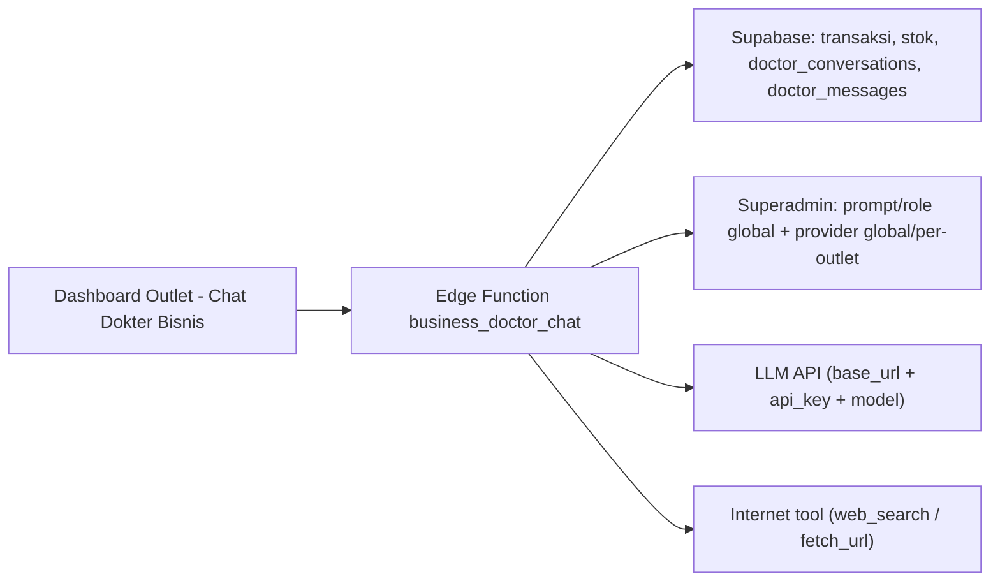

# KASIRGO 3.0 - WORKFLOW LENGKAP (MASTER SINGLE FILE)

> Versi: 3.0 (selaras dengan STRATEGI INDUK KASIRGO 3.0, 18 September 2026)
> File ini menggantikan dokumen workflow versi sebelumnya. Semua konteks proyek, schema,
> roadmap, prompt siap pakai, aturan hemat token, dan test checklist ada di sini.
> Satu session = satu sub-task. Copy prompt, tempel, kerjakan, commit, push, Compact.

---

## BAGIAN 1 - RINGKASAN PRODUK (SUMBER KEBENARAN)

### 1.1 Doktrin Bisnis
KasirGo adalah Operating System UMKM Indonesia yang 100% GRATIS SELAMANYA untuk pengguna.
Tidak ada langganan bulanan. Pihak ketiga (Bank, Distributor FMCG, Brand, Platform Finansial)
yang mendanai ekosistem di belakang layar. KasirGo = Software Orchestrator, bukan pemegang uang.

Doktrin: KasirGo tidak menjual software; KasirGo menjual akses & ekosistem. Warung gratis
selamanya, pihak ketiga membayar, arus kas mengalir otomatis.

Prinsip Hukum & Finansial (WAJIB) - ZERO-TOUCH MONEY:
- Patuh PBI No. 23/6/PBI/2021. KasirGo TIDAK PERNAH menampung/menyimpan uang warung di rekening internal.
- Direct settlement via Escrow Account milik Payment Gateway (PG) resmi berizin PJP Bank Indonesia.
- Komisi platform dipotong otomatis oleh PG lewat Split-Payment API (KasirGo tidak menagih/menampung).
- Semua callback webhook transaksi diverifikasi Digital Signature HMAC SHA-256 di Supabase Edge Functions.
- Model: Master Account / Payment Facilitator ke PG (Tripay/Xendit/Duitku/Midtrans).

### 1.2 Segmentasi & Arsitektur Modular (`outlet_type`)
Satu APK dengan modul dinamis berdasarkan `outlets.outlet_type`:
- `kelontong` (warung): Grosir Mode, Catat Kasbon, Barcode Quick
- `warteg` (warteg/warkop): Mode Porsi/Menu, Kitchen Display, Shift Kasir
- `cafe` (cafe/resto): BOM & Resep HPP, QR Meja Order, Split Bill/Tip
- `retail` (retail/fashion): Barcode Scan, Multi-Variant, Clienteling CRM

### 1.3 12 Revenue Engine (pihak ketiga yang bayar)
1. Dynamic QRIS Take-Rate (0.1-0.3% nilai transaksi) - Payment Gateway/Bank
2. Brand-Sponsored Receipts + Iklan Halaman Pelanggan (kupon FMCG di struk WA + banner sponsor lokal / Adsterra di halaman web pelanggan: katalog online & QR meja; owner TIDAK melihat iklan; Pendukung = bebas iklan)
3. Embedded B2B Restock Engine (komisi 1-3% belanja stok via WebView anti-bypass)
4. Fintech & Credit Lead-Gen (1-2% nilai pinjaman cair)
5. Margin PPOB API (pulsa/PLN/BPJS via Digiflazz/IAK/RCB)
6. Micro-Insurance Toko (komisi 15-30% premi)
7. B2B Clearance Marketplace (obral near-expiry, komisi 3-5%)
8. DOOH Screen Display Ads
9. Hyperlocal Data Intelligence (laporan tren agregat anonim)
10. Hardware Bundling (margin 20-40%)
11. WhatsApp Credit Margin (Rp100/pesan)
12. Program Pendukung (satu paket sukarela Rp50.000/bulan - fitur pertumbuhan, lihat 1.4)

### 1.4 Program Pendukung (satu paket, Rp50.000/bulan)
Semua fitur inti (POS, produk & transaksi tanpa batas, stok, kasbon, laporan dasar, struk WA manual,
QRIS statis+dinamis, AI Co-Pilot dasar, 1 outlet, 1 Admin + 1 Kasir) GRATIS SELAMANYA.
Program Pendukung = fitur pertumbuhan, sukarela, SATU harga.

Harga & durasi disimpan di Control Plane (`platform_financial_configs`), BUKAN hardcode.
- **Pendukung KasirGo - Rp50.000/bulan** (satu paket, akses semua fitur Pendukung).
- **Reverse trial 14 hari** otomatis sejak onboarding; setelah habis fitur terkunci.
  DATA TIDAK DIHAPUS - terbuka kembali saat berlangganan.
- Isi paket:
  - Katalog pelanggan **bebas iklan** (ad-free) + branding sendiri
  - **Laporan otomatis ke bos** (harian/mingguan/bulanan, bisa diset)
  - Multi-outlet (outlet ke-2 dst)
  - Slot staf tambahan di atas kuota gratis (1 Admin + 1 Kasir)
  - Laporan lanjutan + export Excel/PDF + analitik cashflow/tren
  - AI Co-Pilot Pro + Health Score pro
  - WA Marketing broadcast massal + auto-retensi pelanggan
  - Social Commerce Sync + Katalog Online publik + QR Meja dine-in
  - Backup cloud harian + restore + riwayat >30 hari
  - Custom struk (logo toko + footer)
  - Prioritas support + badge Pendukung + Hall of Fame
- Prinsip: **"gratis untuk bertahan, Pendukung untuk bertumbuh"**.
  DILARANG mengunci POS/produk/transaksi/stok, iklan paksa di app, atau menghapus data user.

### 1.5 Roles
| Role | Akses | Platform |
|------|-------|----------|
| Owner | Full akses semua modul outlet + kelola staf + affiliate | Flutter Mobile |
| Admin | Tambah/edit produk + laporan (TIDAK bisa hapus produk) | Flutter Mobile |
| Cashier | POS + shift + tip | Flutter Mobile |
| Kitchen | Kitchen Display (KDS) | Flutter Mobile |
| Customer | Scan QR meja -> order | Flutter Mobile |
| Superadmin | 12 revenue engine, user mgmt, data | React Web |

Aturan izin kunci (ditegakkan di RLS + UI, keduanya wajib):
- **Produk**: Owner tambah/edit/HAPUS. Admin tambah/edit saja -- tombol hapus disembunyikan + RLS menolak DELETE.
- **User staf**: hanya Owner yang create/delete Admin & Kasir (kuota gratis 1 Admin + 1 Kasir; lebih -> Program Pendukung).
- **Affiliate**: hanya Owner melihat link affiliate, rekening bank pencairan, dan laporan closing komisi.
- **Pembayaran**: Owner boleh pasang QRIS statis (upload gambar) atau aktifkan gateway dinamis (via superadmin).
- **KYC wajib**: user baru TIDAK BISA memakai aplikasi (POS/transaksi/modul diblokir total) sebelum
  KYC `verified`. Tidak ada tombol lewati. Detail alur & kemudahan di Bagian 1.11.

### 1.6 Design System v2 - "Centennial Modern Ocean White" (WAJIB, GANTI TOTAL)
Menggantikan dark Glassmorphism. Referensi layout: pola dashboard kasirmurah.com
(hero gradient, kartu stat, grid modul, drawer berkelompok, filter waktu), warna diganti
ke palet Ocean White KasirGo. Semua role (Owner/Admin/Cashier/Kitchen/Customer + Superadmin
Web) memakai sistem yang sama. Berlaku juga untuk produk, pelanggan, karyawan, laporan,
pengaturan. UI-only: DILARANG mengubah fitur/logic/schema/provider/route.

Gaya: Centennial Modern Ocean White + Clean Light Glassmorphism. Tujuan: bersih, terang,
tidak melelahkan mata, proporsional di tablet & desktop (tidak melar/stretched).

Token warna (satu sumber: `config/app_theme.dart` + `tailwind.config.js` admin):
| Token | Nilai |
|-------|-------|
| background | `#F8FAFC` (Slate 50 / Centennial White) |
| surface / card | `#FFFFFF` + border `#E2E8F0` |
| primary | `#0284C7` s/d `#0369A1` (Ocean Sky / Deep Cyan) |
| gradient sekunder | `#06B6D4` -> `#0284C7` |
| text primer | `#0F172A` |
| text sekunder | `#64748B` |
| sukses / aman / untung | `#10B981` |
| peringatan / kasbon / menipis | `#F59E0B` |
| error / habis / void | `#EF4444` |
| badge AI & Insight | gradient `#06B6D4` -> `#4F46E5` |
Font Google Fonts Inter. Radius kartu 16, radius tombol 12, shadow halus elegan (bukan glow).
Min touch target 56dp (primary), 48dp (secondary).

Breakpoint responsif: Mobile 360-599dp, Tablet 600-859dp, Desktop >= 860dp.
- Desktop (>=860dp): sidebar kiri tetap 240dp putih + border kanan `#E2E8F0` (Brand Header
  icon-box gradient + label "KasirGo POS"; nav Dashboard, Produk, POS, Laporan, Pelanggan,
  Karyawan, Pengaturan; footer profil user). Header bar atas 60dp (judul modul aktif + lonceng
  notifikasi + badge counter AI/stok merah). Konten `Center(ConstrainedBox(maxWidth: 1100))`.
  Form sub-screen (Tambah/Edit Produk dll) `maxWidth: 760` dan tetap di dalam shell
  `OwnerHomeScreen` supaya sidebar tidak hilang. Bottom navigation = null.
- Mobile (<860dp): Top bar glassmorphism translucent (tombol drawer + aksi cepat) + Drawer
  dengan header profil, search "Mau cari menu apa?", seksi UTAMA / OPERASIONAL, tombol Keluar
  (merah), footer versi. Bottom nav frosted glass (`BackdropFilter blur 20`) 7 item.

Pola dashboard utama (semua role): hero card gradient (judul periode + nilai omzet besar +
jumlah produk terjual), deret filter waktu chip (Hari Ini, Kemarin, Minggu Ini, Minggu lalu,
Bulan Ini, Bulan lalu, 3 Bulan Terakhir), grid kartu statistik (Potensi Untung, Belum Bayar,
Produk Terjual, Perlu Cek Stok), lalu grid kartu shortcut modul. Fitur yang belum aktif diberi
badge "Segera" (tampil tapi disabled), bukan dihapus.

Kartu katalog & POS: grid 4 kolom (`crossAxisCount: 4`), `childAspectRatio: 0.95`, thumbnail
1:1, nama maks 2 baris (12-13px semi-bold), harga tebal format rupiah, badge stok di pojok
(Hijau >10, Kuning 1-10, Merah 0). Tablet 3 kolom, Mobile 2 kolom.

Pola layar kunci (mengikuti referensi):
- Produk: baris chip pintasan (Kategori, Stok, Harga, Supplier, Penerimaan Stok), header
  "N Jenis Produk" + tombol Urutkan, field cari, chip filter kategori (mis. "Semua"), lalu
  daftar kartu produk (thumbnail, nama, badge status, harga tebal, barcode, info stok).
- POS / Keranjang: pemilih outlet (kartu gradient), toggle Offline/Toko, baris Pelanggan +
  tombol tambah, item (checkbox, thumbnail, nama, stok, harga + ikon edit, stepper qty),
  "Total Tagihan", dan dua aksi: "Atur Belum Bayar" (outlined) + "Lanjut Pembayaran" (filled).
- Warna hijau pada referensi diganti ke palet Ocean White (primary #0284C7 / gradient
  #06B6D4->#0284C7); item bottom nav aktif memakai primary + label tebal.

Elemen pendukung lain (semua dari 11 referensi):
- Header sub-screen: panah kembali + judul tebal, permukaan putih.
- Layar Kasir: kartu outlet + kartu toggle Offline/Toko, header "Pilih Produk/Paket" +
  tombol Urutkan (mis. "Harga"), field cari, chip filter, baris produk dengan radio pilih;
  bar aksi bawah tetap: "Scan Produk" (outlined) + "Keranjang" (filled, ada badge qty).
- Layar Pembayaran: banner status penuh lebar (merah "BELUM LUNAS" / hijau "LUNAS"), daftar
  baris info (Kasir, Tanggal Penjualan, Metode Pembayaran) masing-masing dengan tautan "Ubah",
  blok "Informasi Pelanggan", lalu grid aksi 2x2 (Cetak Struk, Beranda, Kembali, Konfirmasi;
  Konfirmasi = primary filled).
- Modal struk: bottom sheet/modal (Cetak Struk, Convert PDF, Simpan Gambar), pilihan ukuran
  kertas radio 58mm/80mm, tombol Kembali, plus preview struk.
- Form Produk (Tambah/Edit, maxWidth 760): seksi berjudul tebal, OutlinedTextField, dropdown
  kategori, input barcode dengan ikon scan, Harga Modal / Harga Jual Toko (Offline), deskripsi
  multiline, kotak unggah "Gambar Produk" bergaris putus-putus, seksi "Opsi Lanjutan" yang bisa
  dibuka (Harga Jual Online, toggle Produk Dijual), tombol primary penuh lebar (Tambah/Simpan)
  menempel di bawah.
- Scan Kasir: info Outlet, segmented toggle "Kamera" / "Alat Scanner", viewport kamera gelap
  dengan hint, bar Total (N item) + nominal, tombol penuh lebar "Lanjut ke Keranjang".

10 modul bisnis di grid shortcut dashboard utama (badge "Segera" bila belum aktif):
1. Buku Kasbon (`DebtScreen`) - catat piutang pelanggan + pengingat via WhatsApp.
2. PPOB & Pulsa (`PpobScreen`) - transaksi produk digital/token.
3. Kulakan B2B (`RestockScreen`) - order grosir stok (link distributor dari Control Plane).
4. Kitchen Display (`KitchenDisplayScreen`) - monitor pesanan dapur cafe/resto.
5. WA Marketing (`WhatsappBroadcastScreen`) - broadcast promo + auto-retensi pelanggan.
6. Social Commerce (`SocialCommerceScreen`) - sinkron pesanan marketplace (Shopee, Tokped,
   GrabFood, GoFood) dengan potongan fee otomatis.
7. QR Meja Dine-in (`QrTableScreen`) - generator stiker QR per nomor meja untuk self-order.
8. Katalog Online (`OnlineCatalogScreen`) - katalog publik + tombol langsung order ke WhatsApp warung.
9. Health Score Bisnis (`HealthScoreScreen`) - diagnosa performa otomatis (turnover stok, margin, retensi).
10. Pendukung KasirGo (`SupporterScreen`) - program donasi sukarela penjaga aplikasi Rp0 selamanya.

Aturan implementasi (feature-preserving retrofit - lihat Phase 7.6):
- Utamakan komponen bersama di `widgets/common/` (`app_shell.dart`, `stat_card.dart`,
  `hero_card.dart`, `module_tile.dart`, `section_header.dart`, `status_badge.dart`,
  `empty_state.dart`, `price_text.dart`). Screen tidak boleh menyalin styling sendiri.
- Ubah hanya lapisan visual (warna, layout, spacing, komponen). Jangan sentuh provider,
  service, model, schema, query, route, atau alur bisnis.

### 1.7 Tech Stack & Kebijakan Data
- Flutter (Dart) single APK multi-role, offline-first
- React.js + Vite + Tailwind superadmin (deploy Cloudflare Pages, BUKAN Vercel)
- Supabase PostgreSQL + Auth (email + Anonymous) + RLS + Edge Functions + Realtime
- Payment Gateway: Master Account / Payment Facilitator ke PG resmi berizin PJP BI
  (Tripay/Xendit/Duitku/Midtrans); direct settlement via escrow + split-payment API
- Arsitektur data 3 lapis: HOT (SQLite SQLCipher di HP) -> WARM (Supabase 30-90 hari) -> COLD (Cloudflare R2)
- Foto produk LOKAL saja (`image_local_path`). Thumbnail online opt-in ke R2 (`thumb_key`) hanya untuk katalog/QR menu. R2, bukan Supabase Storage.
- AI Co-Pilot 95% local compute (Edge AI, Rp0)
- Sync pakai background Isolate + delta log (event-sourcing) untuk multi-kasir
- Security: SQLCipher, flutter_secure_storage, obfuscation, `service_role` HANYA di Edge Function

### 1.8 Dependencies (pubspec.yaml)
Saat ini: supabase_flutter, drift, sqlite3_flutter_libs, path_provider, go_router,
flutter_riverpod, shared_preferences, intl, mobile_scanner, qr_flutter, barcode, pdf,
printing, excel, url_launcher, connectivity_plus, google_fonts, flutter_animate,
flutter_slidable, fl_chart, cached_network_image, image_picker.

Tambahan 3.0: `sqlcipher_flutter_libs` (enkripsi DB), `flutter_secure_storage` (token),
`webview_flutter` (Embedded B2B Restock).
Tambahan Phase 14 (opsional, UI gaptek): `speech_to_text` (mic) + `flutter_tts` (baca jawaban).

### 1.9 File Structure
```
kasirgo/lib/
  main.dart, app.dart
  config/ (supabase_config, app_theme, constants)
  models/
  services/
  providers/
  screens/auth|owner|admin|cashier|customer/   (mis. cashier/incoming_orders_screen, customer/customer_order_screen)
  screens/modules/                             (kitchen_display = KDS owner)
  widgets/common/pos/
  utils/
kasirgo/supabase/functions/
  stock_alert/  webhook_qris/  create_staff/
kasirgo-admin/src/
```

### 1.10 Control Plane (SEMUA setting lewat Superadmin, TANPA ubah kodingan)
Prinsip: nilai integrasi & margin disimpan di DB (`platform_integrations` + `platform_financial_configs`),
di-cache app, ada fallback default. Ganti nilai = cukup edit di web superadmin.

Yang wajib bisa diset dari superadmin:
| Grup | Isi setting |
|------|-------------|
| Payment Gateway | link/api key PG (Duitku dll), nomor biaya yang dikenakan, margin KasirGo, setting transfer pencairan |
| Financial | threshold gratis biaya, jadwal auto-settlement, biaya BI-FAST, **harga & durasi Program Pendukung**, pajak |
| PPOB | api key (Digiflazz/IAK/RCB), modal, **margin persentase** -> harga jual semua produk PPOB auto ikut harga terbaru |
| B2B Kulakan | link affiliate distributor -> dipakai `RestockScreen` di dashboard owner; ubah link cukup edit di sini |
| Affiliate | komisi dari pembayaran Program Pendukung (upgrade) + sistem pencairan komisi otomatis |
| Fintech | link akun partner fintech/insurtech |
| Storage/Hosting | koneksi Cloudflare R2 (bucket + key) |
| Database | url, user, password, api key koneksi (mis. Supabase) |
| WA | mode WA (Pribadi via `wa.me` nomor KYC default / Cloud API opsional), template pesan, kanal laporan |
| Verifikasi | auto-verify pendaftar yang datanya lengkap (email, nohp, nama toko, alamat, KTP, selfie) |
| Iklan/Ads | `ads_enabled`, provider (`adsterra`/`sponsor_lokal`/`none`), script/zona Adsterra (secret), daftar sponsor lokal, kategori diblokir (judi/dewasa/pinjol), placement (katalog_online/qr_meja), frequency cap, ad-free untuk Pendukung, consent |
| Panduan | daftar item panduan (judul, jenis PDF/video, kategori, role, URL/`file_key`, thumbnail, urutan, aktif) |
| Laporan | template laporan ke bos, jadwal default, kanal (WA pribadi/email/PDF), isi default |
| Kuota & Limit | kuota staf (1 Admin + 1 Kasir), multi-outlet, batas broadcast/export, riwayat data |
| Feature Flags | nyala/mati fitur, rollout persen, per `outlet_type`/segmen |
| Trial & Billing | durasi trial (14 hari), grace period, dunning/retry, auto-renew |

Prinsip skala: **"set sekali, jalan otomatis"**. Konfigurasi berjenjang (Global -> Segmen/Region -> Outlet),
punya versi + jadwal berlaku + rollback. Detail superadmin skala puluhan ribu di Bagian 1.11.

---

### 1.11 Superadmin Skala Besar + Onboarding KYC Wajib + Panduan

#### A. Onboarding KYC wajib (aplikasi terkunci sampai verified)
- Alur: daftar (Anonymous Auth + device UUID, <1 detik) -> **wizard KYC** -> auto-verify -> baru bisa pakai.
- 6 field wajib: email, no HP (WA), nama toko, alamat toko, **foto KTP**, **selfie memegang KTP**.
- Dibuat semudah mungkin: auto-isi (email/HP/nama toko), OCR KTP on-device, kamera berpanduan,
  kompres otomatis (WebP), validasi realtime, draf otomatis, boleh isi offline + kirim saat online,
  tombol bantuan + contoh foto benar/salah.
- Sebelum `verified`: hanya layar KYC, bantuan/support, dan logout yang bisa diakses. POS, produk,
  transaksi, dan semua modul **diblokir total**. Tidak ada tombol lewati. Banner "Selesaikan verifikasi untuk mulai berjualan".
- Status: `unsubmitted` / `draft` / `pending_review` / `verified` / `rejected` (reject -> alasan + kirim ulang).
- Foto KTP/selfie disimpan LOKAL (`image_local_path`); server hanya menyimpan status + data field.
  Anti-duplikat via hash NIK/HP (tanpa menyimpan NIK mentah). Ada persetujuan data (UU PDP).
- Gate ditegakkan di UI + server (RLS/Edge): tanpa `verified`, operasi transaksi ditolak.

#### B. Panduan penggunaan aplikasi (PDF + video, dikelola superadmin)
- Menu "Panduan" di Pengaturan + tombol bantuan/deep-link per modul.
- Konten: **PDF** (dapat disimpan di R2) dan **video** (link YouTube).
- Kategori per modul/role (Mulai, Produk, POS, Laporan, Kasbon, WA, Program Pendukung, dll).
- Fitur: pencarian, thumbnail, urutan, tandai penting; PDF di-cache (offline), video butuh internet.
- Dikelola dari Control Plane (tab Panduan): CRUD judul, jenis, kategori, role, URL/`file_key`,
  thumbnail, urutan, aktif/nonaktif.

#### C. Superadmin Control Plane & manajemen skala puluhan ribu
Pewarisan konfigurasi: **Global -> Segmen/Region -> Outlet** (versi + jadwal berlaku + rollback).
- **Manajemen**: server-side search/filter (nama, no HP, KYC, tier, outlet_type, region, status bayar,
  tanggal daftar, kesehatan sync) + saved views; **bulk action** (suspend/aktifkan, kirim notifikasi,
  beri trial, ubah kuota, tag segmen, reset device); segmentasi otomatis (baru/aktif/tidak aktif/pendukung/bermasalah);
  impersonate + audit + expiry; user detail 360 (outlet, transaksi, langganan, KYC, perangkat, log sync, riwayat support).
- **Otomatisasi (set sekali)**: auto-provision merchant+outlet; auto-KYC; auto-settlement + auto-disbursement;
  auto-trial lalu auto-lock; auto-billing Pendukung (reminder H-3, retry, grace, auto-expire);
  auto-report ke bos; auto-thumbnail R2; auto-arsip data HOT->WARM->COLD; auto-suspend abuse.
- **Rules engine (if-then)**: tidak aktif 30 hari -> retensi; bayar gagal -> retry+dunning;
  trial H-2 -> tawaran upgrade; sync error berulang -> alert ops; KYC ditolak 2x -> review manual;
  stok kritis (AI) -> notif owner.
- **Alat skala**: feature flags + staged rollout (persen/segmen/outlet_type); announcement/in-app message;
  config versioning + rollback; audit log; RBAC tim admin (Superadmin/Finance/Support/Ops); rate limit & quota global.
- **Monitoring**: revenue 12 engine, aktivitas outlet, konversi trial->Pendukung, churn; kesehatan sistem
  (error sync, webhook gagal, pembayaran gagal); alert otomatis ke tim.
- **Keamanan**: secret di-mask; `service_role` hanya di server/Edge Function; audit log wajib saat tim besar.

---

## BAGIAN 2 - ATURAN UMUM & HEMAT TOKEN

### 2.1 Aturan Umum
1. Satu session = satu sub-task. Jangan gabung.
2. Push tiap 1-2 file: `git add . && git commit -m "progress: [file]" && git push`.
3. Baca `AGENTS.md` + `PROGRESS-PHASE*.md` saja sebagai konteks. Jangan baca semua file.
4. Update Progress Tracker di `AGENTS.md` tiap phase selesai.
5. Testing cepat web (JANGAN `flutter run -d web-server` -> memicu "VM offline"/disk penuh):
   `flutter build web --release --base-href /kasirgo/` lalu serve `build/web` (static server) atau deploy ke
   GitHub Pages/Cloudflare Pages. Native (kamera/scan/SQLCipher) diuji via APK debug.
6. APK target <10MB per ABI: `--split-per-abi --obfuscate --split-debug-info=build/debug-info`.
7. Foto produk LOKAL (`image_local_path`), tidak upload Supabase.

### 2.2 Hemat Token (WAJIB)
- Flutter sudah terinstall. Jangan install ulang / flutter doctor / pub get / build APK.
- Perintah panjang redirect ke file. Analyze per file: `dart analyze <file> 2>&1 | tail -20`.
- JANGAN baca file/dokumen yang tidak relevan.
- Output kode saja, tanpa penjelasan/komentar/echo isi file.
- Edit targeted, jangan rewrite file penuh.
- Jangan bolak-balik revisi file yang sama.
- Ganti phase: push -> Compact. Pakai Reset hanya kalau Compact ngawur atau context penuh.
- Di dalam phase: Compact tiap sub-task selesai (bukan reset).
- Jangan paste output panjang (log build, dump file) ke chat.

### 2.2b Budget Token Global (target: Phase 7.5 s/d 12 selesai < 10 juta token)
- 1 sub-task = 1 session; Compact tiap sub-task, Reset saat ganti phase.
- Baca HANYA file yang diedit + `PROGRESS-PHASE*.md`; jangan scan seluruh repo.
- Wajib pakai komponen bersama (`widgets/common/`); retrofit tidak boleh styling ulang per screen.
- Sub-task menyentuh >3 screen -> pecah; <1 file -> gabung dengan sub-task sebelah.
- Transkrip 1 session > ~150k token -> STOP, push, Compact, lanjut.
- Jangan ulang grep/analisa yang sama; catat temuan ke PROGRESS agar tidak dibaca berulang.
- Output hanya diff/kode; screenshot & log disimpan ke file, bukan ditempel ke chat.
- Realistis: retrofit 7.6 (8 sub-task) + sisa phase 8-12 harus tetap hemat; bila melebihi
  budget, kurangi cakupan per session (bukan menaikkan budget).

### 2.3 Error Playbook
Tidak tahu lokasi error:
```
1. dart analyze lib 2>&1 | grep -i error | head -20          # compile: langsung file:baris
2. grep -nE "Error|Exception|Failed" /tmp/run.log | head -15  # runtime
3. Layar blank -> console browser F12, kirim 1 baris pertama saja
4. Persempit: buka 1 screen langsung, isolasi per tab
```
Template perbaikan:
```
=== PERBAIKAN ===
File: [path]
Error: [1-3 baris saja]
Perbaiki HANYA baris/fungsi ini. Jangan baca file lain, jangan refactor, jangan rewrite.
Output hanya diff. dart analyze file itu. STOP.
```
Stop-loss: error sama >2x -> STOP, push, tulis `BLOCKER:` di PROGRESS, Compact/Reset.

### 2.4 PROMPT PEMBUKA UNIVERSAL (tempel di awal SETIAP sub-task)
```
=== KONTEKS KASIRGO 3.0 ===
KasirGo: OS UMKM Indonesia, GRATIS SELAMANYA (tanpa langganan). Flutter + Supabase + offline SQLite.
Role: Owner(full)/Admin(produk+laporan)/Cashier(POS+shift+tip)/Kitchen(KDS)/Customer(QR meja)/Superadmin(web).
Modular per outlet_type: kelontong/warteg/cafe/retail. Foto produk LOKAL (image_local_path).
Design v2 "Centennial Modern Ocean White" (Bagian 1.6): bg #F8FAFC, surface #FFFFFF + border
#E2E8F0, primary #0284C7, gradient #06B6D4->#0284C7, teks #0F172A/#64748B, font Inter.
Pakai komponen bersama `widgets/common/`; DILARANG hardcode warna. UI-only: jangan ubah fitur/logic.
Fitur inti GRATIS SELAMANYA; fitur pertumbuhan via Program Pendukung (satu harga Rp50.000/bulan + trial 14 hari).
Onboarding KYC WAJIB: app terkunci sampai verified. Iklan hanya di web pelanggan (owner tidak lihat); tidak ada iklan tersembunyi.

=== ATURAN HEMAT TOKEN ===
Flutter terinstall; jangan install/pub get/build APK. Baca HANYA PROGRESS file phase ini.
Output hanya kode, tanpa komentar/penjelasan/echo file. Edit targeted, jangan rewrite.
Perintah panjang redirect ke file. Analyze per file: dart analyze <f> 2>&1|tail -20.
Selesai: git add . && git commit -m "progress: [f]" && git push, lalu STOP.

=== ERROR ===
analyze dulu; kirim HANYA file:baris:pesan (bukan stack trace/log penuh); 1 error/percobaan;
error sama >2x -> STOP, push, tulis BLOCKER, laporkan.
```
Cara pakai: tempel PROMPT PEMBUKA UNIVERSAL, lalu blok `=== SUB-TASK ... ===` di bawahnya, jadi satu pesan.
Prompt siap-tempel per sub-task (7.5 -> 7.7 -> 7.6 -> 7.8 -> 8-12): `docs/PROMPT-GILIRAN.md`.
Prompt siap-tempel Phase 14 & Phase 15 (Dokter Bisnis AI): lihat **BAGIAN 14** di file ini.

---

## BAGIAN 3 - DATABASE SCHEMA 3.0

### 3.1 Perubahan tabel existing
- `outlets`: rename `type` -> `outlet_type` (enum kelontong/warteg/cafe/retail); HAPUS `subscription_tier`, `subscription_expiry`; tambah `merchant_id UUID REFERENCES merchants(id)`, `device_uuid TEXT`.
- `user_roles`: role CHECK tambah `kitchen`.
- `products`: tetap. Tambah `has_variants BOOLEAN DEFAULT false`.
- `transactions`: tambah `merchant_id UUID`, `pg_reference_id TEXT` (kanonik; `gateway_ref` alias lama), `qris_type TEXT` (STATIC/DYNAMIC), `payment_status TEXT DEFAULT 'PENDING'` (PENDING/PAID/EXPIRED/CANCELLED), `gross_amount DECIMAL(12,2)`, `mdr_fee_deducted DECIMAL(12,2) DEFAULT 0`, `kasirgo_margin_deducted DECIMAL(12,2) DEFAULT 0`, `net_amount_to_merchant DECIMAL(12,2) DEFAULT 0`, `settlement_status TEXT DEFAULT 'n/a'` (UNSETTLED/SETTLED/PPOB_USED), `tip_amount DECIMAL(12,2) DEFAULT 0`, `shift_id UUID`, `debt_id UUID`, `sync_status TEXT DEFAULT 'synced'`, `event_id TEXT`, `device_id TEXT`; + dine-in: `notes TEXT` (menyimpan "Meja <no>"), `order_status TEXT DEFAULT 'baru'` (baru/diproses/siap/selesai), `REPLICA IDENTITY FULL`, masuk publication `supabase_realtime`.
- `transaction_items`: tambah `variant_id UUID`, `note TEXT`.
- `employees`: tetap untuk absensi; shift pindah ke `shifts`.
- `subscriptions`: OBSOLETE -> ganti `supporters` + `supporter_benefits`.
- `affiliates` / `affiliate_referrals`: repurpose jadi referral Program Pendukung.
- `customers`, `product_prices`, `product_discounts`, `ai_insights`: tetap.

### 3.2 Tabel baru
```
CREATE TABLE supporters (
  id UUID PRIMARY KEY DEFAULT gen_random_uuid(),
  outlet_id UUID REFERENCES outlets(id) ON DELETE CASCADE,
  tier TEXT DEFAULT 'pendukung',
  amount DECIMAL(12,2) DEFAULT 50000,
  status TEXT DEFAULT 'trial' CHECK (status IN ('trial','active','expired','cancelled')),
  trial_started_at TIMESTAMPTZ,
  start_date TIMESTAMPTZ DEFAULT NOW(),
  end_date TIMESTAMPTZ,
  auto_renew BOOLEAN DEFAULT true,
  pg_reference_id TEXT,
  updated_at TIMESTAMPTZ DEFAULT NOW()
);

CREATE TABLE supporter_benefits (
  id UUID PRIMARY KEY DEFAULT gen_random_uuid(),
  outlet_id UUID REFERENCES outlets(id) ON DELETE CASCADE,
  benefit_key TEXT NOT NULL,
  enabled BOOLEAN DEFAULT true,
  UNIQUE(outlet_id, benefit_key)
);

CREATE TABLE product_variants (
  id UUID PRIMARY KEY DEFAULT gen_random_uuid(),
  product_id UUID REFERENCES products(id) ON DELETE CASCADE,
  name TEXT NOT NULL,
  sku TEXT,
  price_delta DECIMAL(12,2) DEFAULT 0,
  stock DECIMAL(12,2) DEFAULT 0
);

CREATE TABLE stock_logs (
  id UUID PRIMARY KEY DEFAULT gen_random_uuid(),
  outlet_id UUID REFERENCES outlets(id) ON DELETE CASCADE,
  product_id UUID REFERENCES products(id),
  variant_id UUID,
  delta DECIMAL(12,2) NOT NULL,
  reason TEXT NOT NULL,
  ref_id UUID,
  device_id TEXT,
  event_id TEXT UNIQUE,
  created_at TIMESTAMPTZ DEFAULT NOW()
);

CREATE TABLE debts (
  id UUID PRIMARY KEY DEFAULT gen_random_uuid(),
  outlet_id UUID REFERENCES outlets(id) ON DELETE CASCADE,
  customer_id UUID REFERENCES customers(id),
  transaction_id UUID REFERENCES transactions(id),
  amount DECIMAL(12,2) NOT NULL,
  paid_amount DECIMAL(12,2) DEFAULT 0,
  status TEXT DEFAULT 'unpaid' CHECK (status IN ('unpaid','partial','paid')),
  due_date DATE,
  note TEXT,
  created_at TIMESTAMPTZ DEFAULT NOW()
);

CREATE TABLE debt_payments (
  id UUID PRIMARY KEY DEFAULT gen_random_uuid(),
  debt_id UUID REFERENCES debts(id) ON DELETE CASCADE,
  amount DECIMAL(12,2) NOT NULL,
  paid_at TIMESTAMPTZ DEFAULT NOW()
);

CREATE TABLE shifts (
  id UUID PRIMARY KEY DEFAULT gen_random_uuid(),
  outlet_id UUID REFERENCES outlets(id) ON DELETE CASCADE,
  user_id UUID REFERENCES auth.users(id),
  shift TEXT DEFAULT 'pagi',
  opened_at TIMESTAMPTZ DEFAULT NOW(),
  closed_at TIMESTAMPTZ,
  opening_cash DECIMAL(12,2) DEFAULT 0,
  closing_cash DECIMAL(12,2)
);

CREATE TABLE tips (
  id UUID PRIMARY KEY DEFAULT gen_random_uuid(),
  outlet_id UUID REFERENCES outlets(id) ON DELETE CASCADE,
  transaction_id UUID REFERENCES transactions(id),
  user_id UUID REFERENCES auth.users(id),
  amount DECIMAL(12,2) NOT NULL,
  created_at TIMESTAMPTZ DEFAULT NOW()
);

CREATE TABLE recipes (
  id UUID PRIMARY KEY DEFAULT gen_random_uuid(),
  outlet_id UUID REFERENCES outlets(id) ON DELETE CASCADE,
  product_id UUID REFERENCES products(id) ON DELETE CASCADE,
  yield_qty DECIMAL(12,2) DEFAULT 1
);

CREATE TABLE recipe_items (
  id UUID PRIMARY KEY DEFAULT gen_random_uuid(),
  recipe_id UUID REFERENCES recipes(id) ON DELETE CASCADE,
  ingredient_product_id UUID REFERENCES products(id),
  qty DECIMAL(12,2) NOT NULL
);

CREATE TABLE ppob_products (
  id UUID PRIMARY KEY DEFAULT gen_random_uuid(),
  sku TEXT UNIQUE NOT NULL,
  name TEXT NOT NULL,
  category TEXT,
  cost_price DECIMAL(12,2),
  sell_price DECIMAL(12,2)
);

CREATE TABLE ppob_transactions (
  id UUID PRIMARY KEY DEFAULT gen_random_uuid(),
  outlet_id UUID REFERENCES outlets(id) ON DELETE CASCADE,
  ppob_product_id UUID REFERENCES ppob_products(id),
  customer_ref TEXT,
  amount DECIMAL(12,2) NOT NULL,
  status TEXT DEFAULT 'pending',
  provider_ref TEXT,
  created_at TIMESTAMPTZ DEFAULT NOW()
);

CREATE TABLE restock_orders (
  id UUID PRIMARY KEY DEFAULT gen_random_uuid(),
  outlet_id UUID REFERENCES outlets(id) ON DELETE CASCADE,
  distributor TEXT,
  tracking_id TEXT,
  amount DECIMAL(12,2) DEFAULT 0,
  status TEXT DEFAULT 'draft',
  created_at TIMESTAMPTZ DEFAULT NOW()
);

CREATE TABLE fintech_leads (
  id UUID PRIMARY KEY DEFAULT gen_random_uuid(),
  outlet_id UUID REFERENCES outlets(id) ON DELETE CASCADE,
  partner TEXT,
  amount_requested DECIMAL(12,2),
  status TEXT DEFAULT 'lead',
  created_at TIMESTAMPTZ DEFAULT NOW()
);

CREATE TABLE receipt_sponsors (
  id UUID PRIMARY KEY DEFAULT gen_random_uuid(),
  brand TEXT NOT NULL,
  image_key TEXT,
  target_url TEXT,
  region TEXT,
  active_from TIMESTAMPTZ,
  active_to TIMESTAMPTZ,
  impression_count INTEGER DEFAULT 0
);

CREATE TABLE merchants (
  id UUID PRIMARY KEY DEFAULT gen_random_uuid(),
  device_uuid VARCHAR(100) UNIQUE NOT NULL,
  store_name VARCHAR(150) NOT NULL DEFAULT 'Warung Saya',
  owner_name VARCHAR(100),
  owner_ktp VARCHAR(20),
  payout_bank_code VARCHAR(20),
  payout_account_number VARCHAR(50),
  payout_account_name VARCHAR(100),
  is_verified BOOLEAN DEFAULT FALSE,
  created_at TIMESTAMPTZ DEFAULT NOW()
);

CREATE TABLE platform_financial_configs (
  id UUID PRIMARY KEY DEFAULT gen_random_uuid(),
  min_qris_amount NUMERIC DEFAULT 1000,
  max_qris_amount NUMERIC DEFAULT 10000000,
  qris_free_threshold NUMERIC DEFAULT 500000,
  qris_base_mdr_percent NUMERIC DEFAULT 0.3,
  kasirgo_margin_percent NUMERIC DEFAULT 0.1,
  kasirgo_margin_flat NUMERIC DEFAULT 0,
  fee_bearer VARCHAR(20) DEFAULT 'MERCHANT',
  min_disbursement_amount NUMERIC DEFAULT 50000,
  disbursement_fee_standard NUMERIC DEFAULT 2500,
  disbursement_fee_instant NUMERIC DEFAULT 3500,
  auto_settlement_schedules TEXT[] DEFAULT ARRAY['12:00','19:00'],
  updated_at TIMESTAMPTZ DEFAULT NOW(),
  updated_by UUID REFERENCES auth.users(id)
);

CREATE TABLE settlements (
  id UUID PRIMARY KEY DEFAULT gen_random_uuid(),
  merchant_id UUID REFERENCES merchants(id) ON DELETE CASCADE,
  batch_ref TEXT,
  total_net NUMERIC DEFAULT 0,
  status TEXT DEFAULT 'pending',
  scheduled_at TIMESTAMPTZ,
  settled_at TIMESTAMPTZ,
  created_at TIMESTAMPTZ DEFAULT NOW()
);

CREATE TABLE disbursements (
  id UUID PRIMARY KEY DEFAULT gen_random_uuid(),
  merchant_id UUID REFERENCES merchants(id) ON DELETE CASCADE,
  amount NUMERIC NOT NULL,
  mode TEXT DEFAULT 'standard' CHECK (mode IN ('standard','instant')),
  fee NUMERIC DEFAULT 0,
  status TEXT DEFAULT 'pending',
  provider_ref TEXT,
  created_at TIMESTAMPTZ DEFAULT NOW()
);

-- Control Plane: satu tempat semua konfigurasi integrasi (ganti di superadmin, tanpa kodingan)
CREATE TABLE platform_integrations (
  id UUID PRIMARY KEY DEFAULT gen_random_uuid(),
  key TEXT UNIQUE NOT NULL,          -- pg_duitku | ppob_digiflazz | b2b_distributor | fintech_partner
                                     -- | cloudflare_r2 | db_connection | wa_business | affiliate
  label TEXT,
  base_url TEXT,
  public_config JSONB DEFAULT '{}',  -- aman ke client (mis. link affiliate distributor B2B)
  secret_config JSONB DEFAULT '{}',  -- api key/password; client TIDAK boleh baca
  is_active BOOLEAN DEFAULT false,
  updated_at TIMESTAMPTZ DEFAULT NOW(),
  updated_by UUID REFERENCES auth.users(id)
);

CREATE TABLE outlet_kyc (
  id UUID PRIMARY KEY DEFAULT gen_random_uuid(),
  outlet_id UUID REFERENCES outlets(id) ON DELETE CASCADE,
  full_name TEXT, phone TEXT, email TEXT, store_name TEXT, store_address TEXT,
  ktp_image_path TEXT,          -- LOKAL di HP (kebijakan foto lokal)
  selfie_ktp_image_path TEXT,   -- LOKAL di HP
  status TEXT DEFAULT 'pending' CHECK (status IN ('pending','verified','rejected')),
  auto_verified BOOLEAN DEFAULT false,
  verified_at TIMESTAMPTZ,
  created_at TIMESTAMPTZ DEFAULT NOW()
);

CREATE TABLE outlet_staff_quota (
  outlet_id UUID PRIMARY KEY REFERENCES outlets(id) ON DELETE CASCADE,
  max_admin INT DEFAULT 1,
  max_cashier INT DEFAULT 1,
  extra_from_supporter BOOLEAN DEFAULT false,
  updated_at TIMESTAMPTZ DEFAULT NOW()
);

CREATE TABLE affiliate_payouts (
  id UUID PRIMARY KEY DEFAULT gen_random_uuid(),
  outlet_id UUID REFERENCES outlets(id) ON DELETE CASCADE,
  amount NUMERIC DEFAULT 0,
  bank_name TEXT, bank_account_no TEXT, bank_account_name TEXT,
  status TEXT DEFAULT 'pending' CHECK (status IN ('pending','processing','paid')),
  provider_ref TEXT,
  created_at TIMESTAMPTZ DEFAULT NOW()
);

-- Program Pendukung (satu paket, Rp50.000/bulan) + entitlement + trial
CREATE TABLE entitlements (
  outlet_id UUID PRIMARY KEY REFERENCES outlets(id) ON DELETE CASCADE,
  is_supporter BOOLEAN DEFAULT false,
  ad_free BOOLEAN DEFAULT false,
  features JSONB DEFAULT '{}',
  trial_ends_at TIMESTAMPTZ,
  updated_at TIMESTAMPTZ DEFAULT NOW()
);

CREATE TABLE billing_events (
  id UUID PRIMARY KEY DEFAULT gen_random_uuid(),
  outlet_id UUID REFERENCES outlets(id) ON DELETE CASCADE,
  event TEXT, amount NUMERIC DEFAULT 0, status TEXT, ref TEXT,
  created_at TIMESTAMPTZ DEFAULT NOW()
);

-- Laporan otomatis ke bos
CREATE TABLE report_schedules (
  id UUID PRIMARY KEY DEFAULT gen_random_uuid(),
  outlet_id UUID REFERENCES outlets(id) ON DELETE CASCADE,
  period TEXT CHECK (period IN ('daily','weekly','monthly')),
  send_time TIME DEFAULT '21:00',
  day_of_week INT, day_of_month INT,
  recipients JSONB DEFAULT '[]',
  channels JSONB DEFAULT '["email"]',
  content_flags JSONB DEFAULT '{}',
  enabled BOOLEAN DEFAULT true,
  last_sent_at TIMESTAMPTZ,
  created_at TIMESTAMPTZ DEFAULT NOW()
);

-- Iklan sisi pelanggan (owner tidak melihat)
CREATE TABLE outlet_ad_state (
  outlet_id UUID PRIMARY KEY REFERENCES outlets(id) ON DELETE CASCADE,
  ad_enabled BOOLEAN DEFAULT true,
  ad_free BOOLEAN DEFAULT false,
  impressions INT DEFAULT 0,
  updated_at TIMESTAMPTZ DEFAULT NOW()
);

-- Panduan penggunaan (PDF + video), dikelola superadmin
CREATE TABLE guide_items (
  id UUID PRIMARY KEY DEFAULT gen_random_uuid(),
  title TEXT NOT NULL,
  kind TEXT CHECK (kind IN ('pdf','video')),
  category TEXT, role TEXT,
  url TEXT, file_key TEXT, thumbnail_key TEXT,
  sort_order INT DEFAULT 0, is_active BOOLEAN DEFAULT true,
  updated_at TIMESTAMPTZ DEFAULT NOW()
);

-- Fondasi Control Plane skala besar
CREATE TABLE platform_configs (
  id UUID PRIMARY KEY DEFAULT gen_random_uuid(),
  key TEXT NOT NULL,
  scope TEXT DEFAULT 'global' CHECK (scope IN ('global','segment','outlet')),
  scope_ref TEXT,
  value JSONB DEFAULT '{}',
  version INT DEFAULT 1,
  effective_from TIMESTAMPTZ,
  updated_by UUID,
  updated_at TIMESTAMPTZ DEFAULT NOW(),
  UNIQUE(key, scope, scope_ref)
);

CREATE TABLE feature_flags (
  id UUID PRIMARY KEY DEFAULT gen_random_uuid(),
  key TEXT UNIQUE NOT NULL,
  enabled BOOLEAN DEFAULT false,
  rollout_pct INT DEFAULT 100,
  segments JSONB DEFAULT '[]',
  outlet_types JSONB DEFAULT '[]',
  updated_at TIMESTAMPTZ DEFAULT NOW()
);

CREATE TABLE automation_rules (
  id UUID PRIMARY KEY DEFAULT gen_random_uuid(),
  name TEXT, trigger TEXT,
  condition JSONB DEFAULT '{}', action JSONB DEFAULT '{}',
  enabled BOOLEAN DEFAULT true, created_at TIMESTAMPTZ DEFAULT NOW()
);

CREATE TABLE segments (
  id UUID PRIMARY KEY DEFAULT gen_random_uuid(),
  name TEXT UNIQUE NOT NULL, rules JSONB DEFAULT '{}',
  created_at TIMESTAMPTZ DEFAULT NOW()
);

CREATE TABLE outlet_segments (
  outlet_id UUID REFERENCES outlets(id) ON DELETE CASCADE,
  segment_id UUID REFERENCES segments(id) ON DELETE CASCADE,
  PRIMARY KEY (outlet_id, segment_id)
);

CREATE TABLE announcements (
  id UUID PRIMARY KEY DEFAULT gen_random_uuid(),
  title TEXT, body TEXT, audience TEXT DEFAULT 'all',
  starts_at TIMESTAMPTZ, ends_at TIMESTAMPTZ,
  is_active BOOLEAN DEFAULT true, created_at TIMESTAMPTZ DEFAULT NOW()
);

CREATE TABLE audit_logs (
  id UUID PRIMARY KEY DEFAULT gen_random_uuid(),
  actor_id UUID, actor_role TEXT, action TEXT, target TEXT,
  meta JSONB DEFAULT '{}', created_at TIMESTAMPTZ DEFAULT NOW()
);

CREATE TABLE admin_users (
  id UUID PRIMARY KEY DEFAULT gen_random_uuid(),
  user_id UUID, role TEXT CHECK (role IN ('superadmin','finance','support','ops')),
  is_active BOOLEAN DEFAULT true, created_at TIMESTAMPTZ DEFAULT NOW()
);
```

### 3.2b Tabel & RPC Pesanan Dine-in Pelanggan (QR Meja)

Alur: pelanggan scan QR meja (anon) -> pilih menu -> **bayar di meja** (QRIS/transfer/tunai,
tanpa antre kasir) -> kirim pesanan -> kasir/dapur menerima via Realtime.

Tabel tambahan:
```sql
-- Info pembayaran outlet (teks saja, TANPA gambar sesuai kebijakan foto)
CREATE TABLE outlet_payment_configs (
  outlet_id UUID PRIMARY KEY REFERENCES outlets(id) ON DELETE CASCADE,
  merchant_name TEXT, bank_wallet TEXT, account_number TEXT,
  nmid TEXT, instruction TEXT, is_active BOOLEAN DEFAULT TRUE,
  updated_at TIMESTAMPTZ DEFAULT NOW()
);
```
- `transactions` tambah: `notes TEXT` (menyimpan "Meja <no>"), `order_status TEXT DEFAULT 'baru'`
  (baru/diproses/siap/selesai), `REPLICA IDENTITY FULL`, dan masuk publication `supabase_realtime`.

RPC (SECURITY DEFINER; customer = anon):
- `get_public_outlet(p_code)` -> outlet publik berdasarkan kode.
- `get_public_menu(p_outlet)` -> katalog produk publik.
- `get_public_outlet_payment(p_outlet)` -> info bayar (merchant/bank/no rekening/nmid/instruksi).
- `place_dine_in_order(p_outlet, p_table, p_items, p_payment_method)` -> buat transaksi `dine_in`
  + item; harga dihitung server-side (anti manipulasi); `p_payment_method` in (cash/qris/bank_transfer).
  Ada shim 3-arg (fallback `'cash'`) untuk kompatibilitas app lama.
- `set_order_status(p_tx, p_status)` -> kasir/owner ubah progres (baru/diproses/siap/selesai).

### 3.3 Trigger/Function
- `handle_new_user`: UBAH, isi `outlet_type` dari `user_metadata`.
- Onboarding owner: Anonymous Auth + `device_uuid` -> auto-create `merchants` + default `outlets`
  (<1 detik). **Wajib lengkapi KYC** sebelum transaksi: email, nohp, nama toko, alamat toko, upload KTP,
  foto selfie memegang KTP (semua LOKAL di HP, hanya nilai verifikasi) -> `outlet_kyc`.
- Auto-verify: jika 6 data KYC lengkap + format valid -> set `status='verified'`, `auto_verified=true`
  (Edge Function). Tidak perlu review manual; admin hanya menangani kasus rejected.
- `decrement_stock`: UBAH, tulis juga ke `stock_logs` (event-sourcing).
- Edge Function `webhook_qris`: verifikasi HMAC SHA-256, update status transaksi LUNAS.
- Edge Function `stock_alert`: cek stok menipis + expired, insert `ai_insights`.
- Cron `auto_settlement`: batch settlement PG sesuai `auto_settlement_schedules` (default 12:00 & 19:00 WIB).

### 3.4 RLS
Pola tetap: Owner full akses outlet sendiri; Admin tambah/edit produk + laporan (DELETE produk DITOLAK);
Cashier POS + insert; Kitchen read order; Superadmin via service key (Edge Function). Terapkan pola yang sama ke
semua tabel baru berbasis `outlet_id`.
- `platform_financial_configs`: superowner full access (`auth.jwt()->>'role'='superowner'`); app client SELECT-only.
- `merchants` / `settlements` / `disbursements`: merchant hanya akses baris miliknya; superowner full access.
- `platform_integrations`: superowner full access; app client hanya boleh SELECT `public_config` (kolom
  `secret_config` TIDAK diekspos ke client -- akses via Edge Function/service key saja).
- `outlet_kyc`: Owner hanya outlet sendiri (read/insert/update); Superadmin full.
- `outlet_staff_quota` / `affiliate_payouts`: Owner read outlet sendiri; Superadmin full; tulis payout via Edge Function.
- Produk DELETE policy: izinkan hanya jika `auth.jwt()->>'role' IN ('owner','superowner')`.
- Kolom margin/fee (`mdr_fee_deducted`, `kasirgo_margin_deducted`, `net_amount_to_merchant`) hanya ditulis server (Edge Function), tidak dari client.
- `supporters` / `entitlements` / `billing_events` / `report_schedules` / `outlet_ad_state`: Owner akses outlet sendiri
  (read; update terbatas); tulis status pembayaran/trial via Edge Function; Superadmin full.
- `guide_items` / `announcements`: Superadmin full (CRUD); app client SELECT-only yang `is_active`.
- `platform_configs` / `feature_flags` / `automation_rules` / `segments` / `outlet_segments` / `audit_logs` / `admin_users`:
  Superadmin/Edge only; app client hanya SELECT `public_config` yang relevan (secret tidak diekspos).
- Gate KYC: operasi transaksi hanya diizinkan bila `outlet_kyc.status='verified'` (ditegakkan RLS + Edge).
- RPC dine-in pelanggan: `get_public_outlet`, `get_public_menu`, `get_public_outlet_payment`,
  `place_dine_in_order`, `set_order_status` -- lihat 3.2b. Grant ke `anon`/`authenticated` sesuai role.

---

## BAGIAN 4 - ROADMAP PHASE

| Phase | Nama | Status |
|-------|------|--------|
| 1 | Supabase DB + Auth | SELESAI |
| 2 | Flutter App Shell + Auth + Offline Engine | SELESAI |
| 3 | Produk + POS + QRIS manual + AI Co-Pilot | SELESAI |
| 4 | Laporan + Pelanggan + Karyawan | SELESAI |
| 5 | Premium Features + Subscription Gate | SELESAI (sebagian OBSOLETE) |
| 5.5A | Retrofit 3.0: DB migration + models/services | SELESAI |
| 5.5B | Retrofit 3.0: UI (hapus subscription, dynamic module, kasbon dasar) | SELESAI |
| 5.5C | Retrofit 3.0: Security (SQLCipher + secure storage) + sync event-sourcing | SELESAI |
| 6 | Kasbon/Piutang + WA + Sponsored Receipt | SELESAI |
| 7 | Dynamic QRIS Payment Gateway + webhook HMAC | SELESAI |
| 7.5 | Zero-Friction Onboarding + Dual-Mode QRIS + Settlement/Disbursement + Superowner Financial Config | SELESAI |
| 7.6 | UI Retrofit "Centennial Modern Ocean White" (semua role + semua fitur) | SELESAI |
| 7.7 | Control Plane (setting superadmin tanpa kodingan) + KYC Auto-Verify + Izin Produk/Staf + Owner Affiliate | SELESAI |
| 7.8 | Monetisasi & Program Pendukung (1 harga Rp50k) + Iklan Pelanggan + Laporan ke Bos + KYC Wajib + Panduan + Skala Superadmin | SELESAI |
| 8 | Modul outlet_type: BOM/Resep, KDS/QR Meja, Variant, Shift/Tip | SELESAI |
| 9 | PPOB + Closed-loop + Embedded B2B Restock | SELESAI |
| 10 | Fintech Lead + Hyperlocal Data + Micro-insurance | SELESAI |
| 11 | Superadmin Web (12 revenue engine, RBAC, rules engine, monitoring) | SELESAI |
| **12** | **Polish + Security Audit + Release** | **MULAI DI SINI** |

Catatan: porsi yang OBSOLETE dari Phase 5 dan harus dibuang di 5.5B: subscription gate
(free/basic_25/pro_50), iklan banner free tier, limit 500 produk/transaksi.
Catatan: Phase 7.8 menggantikan konsep "3 tier Program Pendukung" menjadi satu harga Rp50.000/bulan.
Iklan hanya di sisi pelanggan (web), TIDAK di APK; tidak boleh ada iklan tersembunyi (ad fraud).

---

## BAGIAN 5 - PHASE 5.5A (DB MIGRATION + MODELS/SERVICES)

PROGRESS-PHASE5.5.md:
```
# PROGRESS PHASE 5.5
SELESAI: -
BERIKUTNYA: ST5.5A-1 migration SQL
BLOCKER: -
```

Sub-task:

ST5.5A-1 (migration SQL)
```
=== SUB-TASK ST5.5A-1 ===
Buat docs/migrations/2026-09-18-kasirgo-3.0.sql berisi:
- ALTER outlets: rename type -> outlet_type, drop subscription_tier & subscription_expiry
- ALTER user_roles: tambah role 'kitchen'
- ALTER products: tambah has_variants
- ALTER transactions: tambah gateway_ref, settlement_status, tip_amount, shift_id, debt_id, sync_status, event_id, device_id
- ALTER transaction_items: tambah variant_id, note
- CREATE TABLE: supporters, supporter_benefits, product_variants, stock_logs, debts, debt_payments,
  shifts, tips, recipes, recipe_items, ppob_products, ppob_transactions, restock_orders,
  fintech_leads, receipt_sponsors (lihat BAGIAN 3 dokumen ini)
- CREATE INDEX pada outlet_id tiap tabel baru
File ini tidak perlu flutter analyze. commit+push, STOP.
```

ST5.5A-2 (models)
```
=== SUB-TASK ST5.5A-2 ===
Buat/ubah model Dart (fromJson/toJson, fromMap/toMap):
- ubah models/outlet.dart -> tambah outletType, hapus subscriptionTier/Expiry
- ubah models/transaction.dart -> tambah field gateway/settlement/tip/shift/debt/sync/event/device
- ganti models/subscription.dart jadi models/supporter.dart (tier pendukung/pro/setia)
- BARU: models/debt.dart, models/shift.dart, models/tip.dart, models/recipe.dart,
  models/variant.dart, models/ppob.dart, models/restock.dart
commit+push, analysis per file, STOP.
```

ST5.5A-3 (services)
```
=== SUB-TASK ST5.5A-3 ===
- ubah services/supabase_service.dart: tambah CRUD tabel baru; subscriptions -> supporters
- ubah services/local_db_service.dart: tambah tabel lokal debts, stock_logs, ppob_transactions; gate sync_status
- ubah services/sync_service.dart: siapkan struktur delta log/event_id (implementasi penuh di 5.5C)
commit+push, analysis per file, STOP.
```

ST5.5A-4 (providers)
```
=== SUB-TASK ST5.5A-4 ===
- ganti providers/subscription_provider.dart -> supporter_provider.dart
- ubah providers/outlet_provider.dart -> expose outletType untuk module switcher
- BARU: providers/module_provider.dart (module aktif berdasarkan outletType)
commit+push, analysis per file, STOP.
```

---

## BAGIAN 6 - PHASE 5.5B (UI RETROFIT)

ST5.5B-1 (buang subscription/iklan/limit)
```
=== SUB-TASK ST5.5B-1 ===
- ubah screens/owner/settings_screen.dart: hapus subscription gate -> tampilkan Program Pendukung (Pendukung/Pro/Setia) + status
- hapus banner iklan free tier dari owner_home dan screen lain (grep "iklan"/"banner")
- hapus limit 500 produk (product_list) dan limit 500 transaksi (pos)
- hapus utils/subscription_gate.dart atau repurpose ke supporter_gate
commit+push, analysis per file, STOP.
```

ST5.5B-2 (dynamic module switcher)
```
=== SUB-TASK ST5.5B-2 ===
- ubah screens/owner/owner_home_screen.dart: tampilkan modul sesuai outletType
  (kelontong: Grosir+Kasbon+Barcode; warteg: Porsi+Kitchen+Shift; cafe: BOM+QR Meja+Split Bill/Tip; retail: Barcode+Multi-variant+CRM)
- buat kerangka screen placeholder untuk modul baru (debt, kitchen_display, ppob, restock, supporter)
commit+push, analysis per file, STOP.
```

ST5.5B-3 (kasbon dasar)
```
=== SUB-TASK ST5.5B-3 ===
- buat screens/owner/debt_screen.dart: list piutang/kasbon, status (unpaid/partial/paid), tombol bayar
- integrasi ke customer detail (riwayat piutang)
- tombol "Tagih via WA" pakai url_launcher (pesan singkat)
commit+push, analysis per file, STOP.
```

---

## BAGIAN 7 - PHASE 5.5C (SECURITY + SYNC)

ST5.5C-1 (SQLCipher + secure storage)
```
=== SUB-TASK ST5.5C-1 ===
- tambah dependency sqlcipher_flutter_libs + flutter_secure_storage di pubspec
- ubah services/local_db_service.dart: buka drift dengan enkripsi SQLCipher, key dari flutter_secure_storage (generate simpan di secure storage)
- pindahkan simpanan token/session ke flutter_secure_storage
CATATAN: perubahan pubspec memerlukan pub get - jalankan sekali, redirect ke file.
commit+push, analysis per file, STOP.
```

ST5.5C-2 (event-sourcing sync)
```
=== SUB-TASK ST5.5C-2 ===
- ubah services/sync_service.dart: sync berbasis event_id/delta log, idempotent (event_id UNIQUE)
- jalankan sync di background Isolate terpisah agar POS tidak loading
- tangani konflik stok multi-kasir lewat agregasi event berdasarkan atomic counter/timestamp
commit+push, analysis per file, STOP.
```

---

## BAGIAN 7B - PHASE 7.5 (ZERO-FRICTION ONBOARDING + DUAL-MODE QRIS + SETTLEMENT + FINANCIAL CONFIG)

Buat PROGRESS-PHASE7.5.md. Prasyarat eksternal: akun PG resmi berizin PJP BI
(Tripay/Xendit/Duitku/Midtrans) + webhook secret HMAC. Sebelum tersedia, pakai mode sandbox/mock.

ST7.5-1 (migration SQL)
```
=== SUB-TASK ST7.5-1 ===
Buat docs/migrations/2026-09-21-kasirgo-7.5.sql berisi:
- CREATE TABLE merchants, platform_financial_configs, settlements, disbursements (lihat BAGIAN 3)
- ALTER outlets: tambah merchant_id, device_uuid
- ALTER transactions: tambah merchant_id, pg_reference_id, qris_type, payment_status,
  gross_amount, mdr_fee_deducted, kasirgo_margin_deducted, net_amount_to_merchant
- RLS: platform_financial_configs (superowner full, client SELECT-only);
  merchants/settlements/disbursements (merchant baris sendiri, superowner full)
- Seed 1 baris platform_financial_configs dengan nilai default (lihat BAGIAN 3)
- INDEX pada merchant_id/outlet_id + kolom status
File .sql tidak perlu flutter analyze. commit+push, STOP.
```

ST7.5-2 (zero-friction onboarding)
```
=== SUB-TASK ST7.5-2 ===
- services/auth_service.dart: onboarding Anonymous Auth + device_uuid (device_info/path),
  auto-create merchants + default outlet TANPA form, target <1 detik
- simpan device_uuid aman via flutter_secure_storage
- first-run lewati login; menu Pengaturan sediakan "Tautkan Akun" (Google/No. HP) voluntary untuk backup cloud
- KYC wajib owner (email/nohp/nama toko/alamat/KTP/selfie) TIDAK di sini -- dikerjakan Phase 7.7 (ST7.7-2)
- pembuatan merchant+outlet via Edge Function (jangan service_role di client)
Update PROGRESS-PHASE7.5.md: SELESAI ST7.5-2 + BERIKUTNYA ST7.5-3. commit+push, analysis per file, STOP.
```

ST7.5-3 (dual-mode QRIS)
```
=== SUB-TASK ST7.5-3 ===
- POS: pilih mode QRIS -> STATIC atau DYNAMIC; simpan qris_type & payment_status di transaksi
- STATIC: input nominal -> instruksi scan stiker bank warung -> tombol "LUNAS (Statis)" -> set PAID
- DYNAMIC: panggil payment_service create charge -> tampil QR ber-nominal pas -> webhook set PAID
- Validasi nominal dari platform_financial_configs (min/max/free threshold), baca + cache
Update PROGRESS-PHASE7.5.md: SELESAI ST7.5-3 + BERIKUTNYA ST7.5-4. commit+push, analysis per file, STOP.
```

ST7.5-4 (settlement & disbursement + BI-FAST)
```
=== SUB-TASK ST7.5-4 ===
- services/settlement_service.dart: hitung net (gross - mdr - margin) dari config; catat settlements
- UI saldo dipisah: "QRIS Diproses (Cair Nanti Malam)" vs "Total Ditransfer"
- Tarik Kilat (BI-FAST): buat disbursements mode 'instant' + fee dari config
- Edge Function cron auto_settlement: batch sesuai auto_settlement_schedules (12:00 & 19:00 WIB)
- Hook closed-loop: settlement_status='PPOB_USED' saat saldo dipakai beli PPOB (dipakai Phase 9)
Update PROGRESS-PHASE7.5.md: SELESAI ST7.5-4 + BERIKUTNYA ST7.5-5. commit+push, analysis per file, STOP.
```

ST7.5-5 (superowner financial config)
```
=== SUB-TASK ST7.5-5 ===
- Superadmin web: form kelola platform_financial_configs (threshold, MDR, margin, fee_bearer,
  jadwal settlement, biaya disbursement); simpan + catat updated_by
- App mobile: baca config untuk validasi nominal + tampilkan rincian biaya transparan
Update PROGRESS-PHASE7.5.md: SELESAI Phase 7.5 + BERIKUTNYA Phase 7.6. commit+push, analysis per file, STOP.
```

---

## BAGIAN 7C - PHASE 7.6 (UI RETROFIT CENTENNIAL MODERN OCEAN WHITE)

Tujuan: menyamakan SELURUH tampilan (Superadmin web, Owner, Admin, Cashier, Kitchen,
Customer, serta fitur Produk/Pelanggan/Karyawan/Laporan/Pengaturan) ke Design System v2
(Bagian 1.6). Referensi layout kasirmurah.com, palet Ocean White. Aturan mutlak:
UI-ONLY, feature-preserving. DILARANG mengubah logic, provider, service, model, schema,
query, route, atau alur bisnis. Hanya lapisan visual.

PROGRESS-PHASE7.6.md:
```
# PROGRESS PHASE 7.6
SELESAI: -
BERIKUTNYA: ST7.6-1 token & tema dasar
BLOCKER: -
```

ST7.6-1 (token & tema dasar)
```
=== SUB-TASK ST7.6-1 ===
- config/app_theme.dart: ganti total ke palet Ocean White (Bagian 1.6) - ColorScheme light,
  scaffold #F8FAFC, card #FFFFFF + border #E2E8F0, primary #0284C7, gradient #06B6D4->#0284C7,
  text #0F172A/#64748B, status #10B981/#F59E0B/#EF4444, font Inter, radius/shadow, breakpoint.
- themes AppBar/Card/Input/ElevatedButton/BottomNav/Chip/TabBar ikut token.
- kasirgo-admin: tailwind.config.js + index.css tema light Ocean (warna & radius sama).
- grep dan hapus hardcode warna lama (#4F46E5,#0F172A bg,#1E293B) di seluruh lib/ dan src/;
  arahkan ke token. TIDAK menyentuh widget logic.
Update PROGRESS-PHASE7.6.md: SELESAI ST7.6-1 + BERIKUTNYA ST7.6-2. commit+push, analysis per file, STOP.
```

ST7.6-2 (shared widget kit)
```
=== SUB-TASK ST7.6-2 ===
Buat widgets/common/ (komponen bersama, dipakai semua role):
- app_shell.dart: OwnerHomeScreen shell adaptif - Desktop sidebar 240dp + header 60dp +
  Center(ConstrainedBox(maxWidth:1100)); Mobile app bar glass + drawer (profil, search,
  seksi UTAMA/OPERASIONAL, Keluar, versi) + bottom nav frosted blur 20 (7 item).
  Ekspos param `child`, `title`, `activeIndex`, `bottomNav`.
- hero_card.dart, stat_card.dart, module_tile.dart (ikon+label, dukung badge "Segera"),
  section_header.dart, status_badge.dart (aman/menipis/habis, kasbon, AI), empty_state.dart,
  price_text.dart, filter_chips.dart (periode 7 pilihan).
- Terapkan di 1 screen pilot (owner_home) untuk validasi; sisanya di sub-task berikut.
Update PROGRESS-PHASE7.6.md: SELESAI ST7.6-2 + BERIKUTNYA ST7.6-3. commit+push, analysis per file, STOP.
```

ST7.6-3 (dashboard Owner + grid 10 modul)
```
=== SUB-TASK ST7.6-3 ===
- screens/owner/owner_home.dart: pakai AppShell + HeroCard (omzet periode + produk terjual) +
  FilterChips + 4 StatCard (Potensi Untung, Belum Bayar, Produk Terjual, Perlu Cek Stok) +
  grid kartu shortcut 10 modul bisnis (Bagian 1.6) dengan badge "Segera" untuk yang belum ada.
- Data tetap dari provider/state yang sudah ada; jangan ubah query/logic.
Update PROGRESS-PHASE7.6.md: SELESAI ST7.6-3 + BERIKUTNYA ST7.6-4. commit+push, analysis per file, STOP.
```

ST7.6-4 (Produk, POS, Pelanggan, Karyawan)
```
=== SUB-TASK ST7.6-4 ===
- product_list: chip pintasan (Kategori/Stok/Harga/Supplier/Penerimaan Stok) + header
  "N Jenis Produk" + Urutkan + cari + chip "Semua" + kartu produk (thumbnail, nama, badge
  status, harga tebal, barcode, info stok). Grid 4 kolom / rasio 0.95 / badge stok
  (Hijau>10, Kuning1-10, Merah0). Tablet 3 kolom, mobile 2 kolom.
- product_form (di dalam shell, `maxWidth: 760`): seksi berjudul, OutlinedTextField, dropdown
  kategori, barcode + ikon scan, Harga Modal/Harga Jual, deskripsi multiline, kotak unggah
  "Gambar Produk" dashed, "Opsi Lanjutan" expandable, tombol primary penuh lebar di bawah.
- pos: grid katalog 4 kolom + cart panel tetap fungsional (tidak ubah logika cart/checkout).
- customer_list + employee: list/kartu + status_badge + empty_state v2.
Update PROGRESS-PHASE7.6.md: SELESAI ST7.6-4 + BERIKUTNYA ST7.6-5. commit+push, analysis per file, STOP.
```

ST7.6-5 (Laporan, Pengaturan, Health Score, modul bisnis)
```
=== SUB-TASK ST7.6-5 ===
- report: kartu ringkas + chart fl_chart palet Ocean (tanpa ubah kalkulasi laporan).
- settings: seksi bertoken v2 (Program Pendukung, outlet, printer, dsb tetap utuh).
- health_score + screens modul: debt, ppob, restock, kitchen_display, whatsapp_broadcast,
  social_commerce, qr_table, online_catalog, supporter -> seragamkan via AppShell + kit.
- Belum ada screen-nya: tampilkan kartu "Segera" (jangan buat logic baru di fase ini).
Update PROGRESS-PHASE7.6.md: SELESAI ST7.6-5 + BERIKUTNYA ST7.6-6. commit+push, analysis per file, STOP.
```

ST7.6-6 (Cashier, Admin, Kitchen, Customer)
```
=== SUB-TASK ST7.6-6 ===
- cashier_home: kartu outlet + toggle Offline/Toko, header "Pilih Produk/Paket" + Urutkan +
  cari + chip, baris produk radio; bar aksi "Scan Produk" (outlined) + "Keranjang" (filled).
  Alur bayar/QRIS tidak berubah.
- checkout/pembayaran: banner status lebar (merah BELUM LUNAS / hijau LUNAS), baris info
  (Kasir/Tanggal/Metode) + "Ubah", Informasi Pelanggan, grid aksi 2x2 (Cetak Struk, Beranda,
  Kembali, Konfirmasi).
- modal struk: Cetak Struk / Convert PDF / Simpan Gambar + radio 58mm/80mm + Kembali + preview.
- scan: segmented "Kamera"/"Alat Scanner" + viewport + bar Total (N item) + "Lanjut ke Keranjang".
- admin_home, kitchen KDS, customer_menu: shell + kit yang sama; status order pakai status_badge.
Update PROGRESS-PHASE7.6.md: SELESAI ST7.6-6 + BERIKUTNYA ST7.6-7. commit+push, analysis per file, STOP.
```

ST7.6-7 (Superadmin Web React)
```
=== SUB-TASK ST7.6-7 ===
- kasirgo-admin/src: Layout.jsx sidebar putih 240dp + header, semua pages (Login, Dashboard,
  Users, UserDetail, Affiliates, Backup, Revenue) pakai token Tailwind Ocean; tabel/kartu/
  badge/button seragam. Tidak ubah API call, auth, atau logic data.
Update PROGRESS-PHASE7.6.md: SELESAI ST7.6-7 + BERIKUTNYA ST7.6-8. commit+push, analysis per file, STOP.
```

ST7.6-8 (QA regresi + progress)
```
=== SUB-TASK ST7.6-8 ===
- flutter analyze bersih; build web html + npm run build admin sukses.
- Checklist fitur utuh: auth, CRUD produk, POS+QRIS, laporan, pelanggan, karyawan, pengaturan,
  kasbon, WA, modul lain - pastikan tidak ada yang hilang/berubah fungsi akibat retrofit.
- Uji tampilan 3 breakpoint (360/768/1280): tidak stretched, sidebar muncul di >=860dp,
  bottom nav hanya mobile, kartu stat & grid rapi.
- Simpan screenshot; update PROGRESS-PHASE7.6.md SELESAI + BERIKUTNYA Phase 8.
- Update tracker AGENTS.md (Design System v2 + Phase 7.6 SELESAI). commit+push, STOP.
```

Catatan: bila screen modul bisnis baru dibuat di Phase 8/9, WAJIB langsung memakai
AppShell + kit v2 (tidak boleh mulai dari tema lama).

---

## BAGIAN 7D - PHASE 7.7 (CONTROL PLANE + KYC + IZIN + SETTING SUPERADMIN)

Buat PROGRESS-PHASE7.7.md. Tujuan: semua integrasi/margin/limit bisa diubah dari superadmin
TANPA menyentuh kodingan (lihat Bagian 1.10). Satu sub-task = satu session.

ST7.7-1 (migration + models)
```
=== SUB-TASK ST7.7-1 ===
Buat docs/migrations/2026-09-21-kasirgo-7.7.sql berisi:
- CREATE TABLE platform_integrations, outlet_kyc, outlet_staff_quota, affiliate_payouts (BAGIAN 3)
- RLS sesuai BAGIAN 3.4 (secret_config TIDAK ke client; DELETE produk owner-only)
- Seed platform_integrations baris kosong (is_active=false) untuk: pg_duitku, ppob_digiflazz,
  b2b_distributor, fintech_partner, cloudflare_r2, db_connection, wa_business, affiliate
- models/platform_config.dart + services/config_service.dart: fetch semua config aktif,
  cache di shared_preferences/sqlite, fallback ke nilai default bila offline
File .sql tidak perlu flutter analyze. commit+push, STOP.
```

ST7.7-2 (KYC owner + auto-verify)
```
=== SUB-TASK ST7.7-2 ===
- screens/auth/onboarding_kyc_screen.dart: form email, nohp, nama toko, alamat toko,
  upload KTP + selfie memegang KTP (image_picker, simpan LOKAL -> image path saja)
- gate: sebelum KYC verified, blokir POS/transaksi; tampilkan banner "Lengkapi verifikasi"
- Edge Function verify_kyc: validasi 6 field + format -> set status verified + auto_verified
- Owner lihat status verifikasi di Pengaturan
Update PROGRESS-PHASE7.7.md: SELESAI ST7.7-2 + BERIKUTNYA ST7.7-3. commit+push, analysis per file, STOP.
```

ST7.7-3 (izin + kelola staf)
```
=== SUB-TASK ST7.7-3 ===
- produk: sembunyikan tombol hapus untuk Admin (UI) + andalkan RLS menolak DELETE (server)
- screens/owner/staff_management_screen.dart: Owner create/delete Admin & Kasir;
  enforce outlet_staff_quota (default 1 Admin + 1 Kasir); kelebihan -> ajakan Program Pendukung
Update PROGRESS-PHASE7.7.md: SELESAI ST7.7-3 + BERIKUTNYA ST7.7-4. commit+push, analysis per file, STOP.
```

ST7.7-4 (owner affiliate + pembayaran statis)
```
=== SUB-TASK ST7.7-4 ===
- screens/owner/affiliate_screen.dart: tampilkan link affiliate, setting rekening bank pencairan,
  laporan closing komisi (total, pending, cair)
- Pengaturan > Pembayaran: opsi QRIS STATIS (upload gambar QRIS yang sudah ada) atau DINAMIS
  (aktif via superadmin); simpan pilihan + gambar lokal
Update PROGRESS-PHASE7.7.md: SELESAI ST7.7-4 + BERIKUTNYA ST7.7-5. commit+push, analysis per file, STOP.
```

ST7.7-5 (superadmin control plane web)
```
=== SUB-TASK ST7.7-5 ===
kasirgo-admin: halaman Settings (tab) mengelola platform_integrations + financial config:
- Payment Gateway: link, api key, nominal biaya, margin KasirGo, setting pencairan
- PPOB: api key Digiflazz/IAK/RCB, modal, margin persen -> harga jual semua produk auto
- B2B Kulakan: link affiliate distributor (public_config) dipakai RestockScreen owner
- Affiliate: komisi upgrade Program Pendukung + pencairan otomatis
- Fintech: link akun partner fintech/insurtech
- Storage: koneksi Cloudflare R2 (bucket+key)
- Database: url/user/password/apikey koneksi (mis. Supabase)
- WA Bisnis: api key WA Cloud API
Pakai token Tailwind v2; secret di-mask. commit+push, STOP.
```

ST7.7-6 (app baca config dinamis + QA)
```
=== SUB-TASK ST7.7-6 ===
- pastikan PPOB/Restock/WA/upload thumbnail membaca config dari config_service (cache+fallback),
  tidak ada nilai integrasi yang di-hardcode
- QA: ubah link distributor & margin persen di superadmin -> app ikut berubah tanpa rebuild backend
- Update tracker AGENTS.md (Phase 7.7 SELESAI). commit+push, STOP.
```

Catatan: Phase 7.8/9 lanjut memakai config yang sama; jangan hardcode ulang nilai integrasi.

---

## BAGIAN 7E - PHASE 7.8 (MONETISASI & PROGRAM PENDUKUNG + IKLAN PELANGGAN + LAPORAN KE BOS + KYC WAJIB + PANDUAN + SKALA SUPERADMIN)

Buat PROGRESS-PHASE7.8.md. Tujuan: ganti 3 tier Program Pendukung menjadi SATU harga Rp50.000/bulan
(+ reverse trial 14 hari), pindahkan sebagian fitur gratis ke Pendukung, tambah iklan sisi pelanggan
(config Control Plane), laporan otomatis ke bos, onboarding KYC wajib yang mudah, panduan PDF/video,
dan fondasi superadmin siap skala puluhan ribu. Satu sub-task = satu sesi, commit+push, Compact.
Prasyarat: WA pribadi (nomor KYC) via `wa.me` untuk manual; email/PDF untuk laporan otomatis.

ST7.8-1 (migration SQL + seed)
```
=== SUB-TASK ST7.8-1 ===
Buat docs/migrations/2026-09-28-kasirgo-7.8.sql berisi:
- CREATE TABLE supporters (tier 'pendukung', amount 50000, status trial/active/expired/cancelled,
  trial_started_at, period_start/end, auto_renew, pg_reference_id)
- CREATE TABLE entitlements (is_supporter, ad_free, features jsonb, trial_ends_at)
- CREATE TABLE billing_events, report_schedules, outlet_ad_state, guide_items
- CREATE TABLE platform_configs (scope global/segment/outlet + version + effective_from + updated_by)
- CREATE TABLE feature_flags, automation_rules, segments, outlet_segments, announcements,
  audit_logs, admin_users
- ALTER outlets: kolom nomor WA owner (dari KYC) bila belum ada
- Seed grup Control Plane: ads, guide, report, kyc, quota, flags, billing
- RLS sesuai Bagian 3.4 (tabel baru)
File .sql tidak perlu flutter analyze. commit+push, STOP.
```

ST7.8-2 (supporter service + entitlement + trial)
```
=== SUB-TASK ST7.8-2 ===
- services/supporter_service.dart: baca harga/durasi dari platform_financial_configs (cache+fallback),
  status trial/active/expired, auto-renew, checkout via QRIS existing
- entitlements: is_supporter, ad_free, hasFeature(key)
- reverse trial 14 hari otomatis saat onboarding KYC verified (set entitlements.trial_ends_at)
- simpan nomor WA owner dari KYC untuk dipakai wa.me
Update PROGRESS-PHASE7.8.md: SELESAI ST7.8-2 + BERIKUTNYA ST7.8-3. commit+push, STOP.
```

ST7.8-3 (UI Program Pendukung)
```
=== SUB-TASK ST7.8-3 ===
- settings_screen.dart: ganti 3 tier jadi SATU kartu "Pendukung KasirGo Rp50.000/bulan" + status trial/aktif
- _showUpgradeModal -> checkout QRIS; tampilkan sisa hari trial
- badge terkunci pada fitur Pendukung
Update PROGRESS-PHASE7.8.md: SELESAI ST7.8-3 + BERIKUTNYA ST7.8-4. commit+push, STOP.
```

ST7.8-4 (gate fitur pindahan)
```
=== SUB-TASK ST7.8-4 ===
Gate via hasFeature() untuk fitur yang dipindah dari gratis ke Pendukung:
WA Marketing broadcast + auto-retensi, Social Commerce Sync, Katalog Online/QR Meja, AI Pro +
Health Score pro, laporan lanjutan + export Excel/PDF, backup cloud + restore, multi-outlet,
slot staf ke-3 dst, custom struk/logo. Data lama tidak dihapus, hanya akses dikunci.
Update PROGRESS-PHASE7.8.md: SELESAI ST7.8-4 + BERIKUTNYA ST7.8-5. commit+push, STOP.
```

ST7.8-5 (laporan otomatis ke bos)
```
=== SUB-TASK ST7.8-5 ===
- screens/owner/report_schedule_screen.dart: set periode (harian/mingguan/bulanan), jam/hari/tanggal,
  sampai 3 penerima, isi laporan (toggle), kanal (WA pribadi one-tap / email-PDF)
- notifikasi lokal (flutter_local_notifications) -> tap buka WhatsApp dengan teks laporan siap kirim
- Edge Function cron: bangun laporan + kirim email/PDF otomatis
Update PROGRESS-PHASE7.8.md: SELESAI ST7.8-5 + BERIKUTNYA ST7.8-6. commit+push, STOP.
```

ST7.8-6 (iklan pelanggan)
```
=== SUB-TASK ST7.8-6 ===
- halaman web katalog online + QR meja baca config `ads` dari platform_configs (cache+fallback)
- tampilkan iklan WAJAR non-intrusif (bukan popunder, tidak menutupi tombol); owner tidak melihat
- ad_free untuk Pendukung; blokir kategori judi/dewasa/pinjol; consent (UU PDP)
- mode: sponsor_lokal diutamakan, adsterra fallback; TIDAK ada iklan tersembunyi
Update PROGRESS-PHASE7.8.md: SELESAI ST7.8-6 + BERIKUTNYA ST7.8-7. commit+push, STOP.
```

ST7.8-7 (onboarding KYC wajib)
```
=== SUB-TASK ST7.8-7 ===
- screens/auth/onboarding_kyc_screen.dart: wizard 6 field (email, nohp, nama toko, alamat toko,
  foto KTP, selfie pegang KTP) + persetujuan data
- kemudahan: auto-isi, OCR KTP on-device (opsional), kamera berpanduan, kompres otomatis, validasi
  realtime, draf otomatis, boleh offline + kirim saat online, tombol bantuan + contoh foto
- GATE: sebelum verified -> hanya layar KYC/bantuan/logout; POS, produk, transaksi, semua modul DIBLOKIR.
  Tidak ada tombol lewati; banner "Selesaikan verifikasi untuk mulai berjualan"
- status unsubmitted/draft/pending_review/verified/rejected; reject -> alasan + kirim ulang
- foto simpan LOKAL; anti-duplikat hash NIK/HP; Edge Function verify_kyc auto-verify 6 field + format
Update PROGRESS-PHASE7.8.md: SELESAI ST7.8-7 + BERIKUTNYA ST7.8-8. commit+push, STOP.
```

ST7.8-8 (panduan penggunaan PDF + video)
```
=== SUB-TASK ST7.8-8 ===
- screens/owner/guide_screen.dart: daftar panduan dari guide_items (config), filter kategori/role,
  pencarian, thumbnail; PDF di-cache (offline), video buka link YouTube
- tombol/deep-link bantuan per modul; menu "Panduan" di Pengaturan
- konten dikelola superadmin (Bagian 7E ST7.8-9)
Update PROGRESS-PHASE7.8.md: SELESAI ST7.8-8 + BERIKUTNYA ST7.8-9. commit+push, STOP.
```

ST7.8-9 (Control Plane superadmin + QA + dokumen)
```
=== SUB-TASK ST7.8-9 ===
kasirgo-admin: tab Settings Control Plane lengkap:
- Iklan (provider, script/zona secret, sponsor lokal, kategori diblokir, placement, ad-free, consent)
- Panduan (CRUD guide_items: judul, jenis PDF/video, kategori, role, URL/file, thumbnail, urutan, aktif)
- Financial (harga & durasi Pendukung), Laporan (template/jadwal/kanal), KYC, Kuota & Limit, Feature Flags
- Otomatisasi dasar: auto-trial/auto-lock, auto-report, auto-KYC; secret di-mask; audit_logs
- Update dokumen (KASIRGO-WORKFLOW-LENGKAP, AGENTS) + tracker; QA ubah config -> app ikut berubah
Update PROGRESS-PHASE7.8.md: SELESAI Phase 7.8 + BERIKUTNYA Phase 8. commit+push, STOP.
```

---

## BAGIAN 8 - PHASE 6-12 (MODUL 3.0)

Gunakan pola yang sama: tempel PROMPT PEMBUKA UNIVERSAL + SUB-TASK, satu per sesi, commit+push, Compact.

### PHASE 6 - Kasbon/Piutang + WA + Sponsored Receipt  [SELESAI]
- ST6-1: `utils/wa_helper.dart` (sendReceipt, sendBroadcast, openChat) + tombol kirim struk WA di checkout
- ST6-2: struk WhatsApp tampilkan banner kupon sponsor dari `receipt_sponsors` + increment impression
- ST6-3: CRM auto-retensi (deteksi pelanggan tidak aktif >30 hari) + broadcast
- Test: kirim struk, banner sponsor muncul, broadcast terkirim.

### PHASE 7 - Dynamic QRIS Payment Gateway  [SELESAI]
- ST7-1: `services/payment_service.dart` (create QRIS charge via REST API gateway) + tampil QR dinamis di POS
- ST7-2: Edge Function `webhook_qris` verifikasi HMAC SHA-256 -> update transaksi LUNAS
- ST7-3: direct settlement + split-payment logic (komisi platform dipotong gateway, bukan ditampung KasirGo)
- Test: QR dinamis tampil, webhook set LUNAS, settlement tercatat.

### PHASE 7.6 - UI Retrofit "Centennial Modern Ocean White"
Lihat BAGIAN 7C (ST7.6-1 s/d ST7.6-8). UI-only, semua role + semua fitur.

### PHASE 7.7 - Control Plane + KYC + Izin + Setting Superadmin
Lihat BAGIAN 7D (ST7.7-1 s/d ST7.7-6). Semua setting integrasi/margin lewat superadmin, tanpa kodingan.

### PHASE 7.8 - Monetisasi & Program Pendukung (1 harga Rp50k) + Iklan Pelanggan + Laporan ke Bos + KYC Wajib + Panduan + Skala Superadmin
Lihat BAGIAN 7E (ST7.8-1 s/d ST7.8-9). Ganti 3 tier jadi 1 harga Rp50.000/bulan + trial 14 hari;
pindah sebagian fitur ke Pendukung; iklan hanya sisi pelanggan (web); laporan otomatis ke bos;
onboarding KYC wajib (app terkunci sampai verified); panduan PDF/video via Control Plane.

### PHASE 8 - Modul per outlet_type  [SELESAI]
- ST8-1: Modul dinamis per outlet_type + migrasi/RLS (variant, resep, shift, tip)
- ST8-2: Variant produk (product_form + product_list + POS pilih varian) - retail
- ST8-3: BOM/Resep HPP (recipe + recipe_items) + kalkulasi HPP otomatis + potong stok bahan - cafe
- ST8-4: Kitchen Display (KDS): daftar order masuk, status baru->diproses->siap->selesai - cafe/warteg
- ST8-5: Shift kasir (open/close + opening/closing cash + selisih) + Tip + Split Bill
- ST8-6: QA per outlet_type + dokumen.

### PHASE 9 - PPOB + Embedded B2B Restock  [SELESAI]
- ST9-1: `services/ppob_service.dart` + `screens/owner/ppob_screen.dart` (pulsa/PLN/BPJS/game);
  api key + **margin persen dari `platform_integrations`/config** -> harga jual semua produk PPOB auto
- ST9-2: Closed-loop settlement (saldo QRIS -> beli PPOB real-time)
- ST9-3: Embedded B2B Restock via WebView anti-bypass + tracking_id + komisi;
  **link distributor diambil dari config superadmin** (ganti link = tanpa ubah koding)
- Test: transaksi PPOB, restock order tercatat.

### PHASE 10 - Fintech + Data + Insurance  [SELESAI]
- ST10-1: Fintech lead-gen (ajukan modal berdasarkan data arus kas)
- ST10-2: Hyperlocal data report (agregat anonim)
- ST10-3: Micro-insurance toko
- Test: lead tercatat.

### PHASE 11 - Superadmin Web (React + Cloudflare Pages)  [SELESAI]
- ST11-1: Dashboard 12 revenue engine + supporters + user mgmt (data real, chart)
- ST11-2: Impersonate, backup/restore, data intelligence
- ST11-3: Control Plane lengkap (PG, PPOB, B2B, Affiliate, Fintech, R2, DB, WA, Ads, Panduan,
  Financial, Laporan, KYC, Kuota, Feature Flags) -- lihat BAGIAN 7D/7E/1.10
- ST11-4: Skala superadmin: RBAC `admin_users`, `audit_logs`, `segments`/`outlet_segments`,
  `announcements`, `automation_rules`, monitoring; config inheritance + versioning/rollback
- Test: login superadmin, statistik tampil, ubah config -> app ikut berubah.

### PHASE 12 - Polish + Security Audit + Release
- ST12-1: Obfuscation + hardening + audit `service_role` tidak ada di APK
- ST12-2: Stress test offline-online sync Isolate
- ST12-3: Build APK release split-per-abi <10MB + deploy superadmin
- Test: full flow end-to-end semua role + offline + Program Pendukung.

### PHASE 14 - Dokter Bisnis AI (Chat Agent + Diagnosa + Resep)  [BAGIAN 13]
- Untuk OUTLET BERLANGGANAN (Program Pendukung aktif) = fitur berbayar. Bahasa Indonesia.
- Chat langsung di dashboard (seperti tool task) setelah provider terkoneksi.
- Kunci provider (base_url/api_key/model) HANYA di superadmin (global + per outlet); owner tidak lihat.
- Diagnosa 3 fase (Cold-Start/Migration/Data-Driven) -> vonis + Peta Resep 8 langkah + aksi.
- Diagnosa awal bisnis baru (indikator fisik/visual/perilaku + data internet per tipe bisnis).
- Analisa hasil resep boleh dari luar app (online/brosur/offline) + data internet (tool web search/fetch).
- Resep gagal ditangani lewat Escalation Ladder (evaluasi ulang -> akar masalah -> resep lini kedua ->
  kasus bandel -> eskalasi manusia).
- Hasil diagnosa & resep TERSIMPAN sebagai MEMORI (`doctor_memory` + `doctor_outlet_profile`); Dokter
  Bisnis mengingat & mengobservasi kasus sebelumnya saat solusi tidak tercapai (lihat 13.15).
- Sumber data resep TANPA integrasi API (offline/internal) + aksi baru + library/confidence (lihat 13.17).
- Data internet TANPA API resmi: fetch halaman publik, open data tanpa kunci, kemampuan online provider,
  atau input manual owner (lihat 13.19).
- Hasil diagnosa ditampilkan sebagai LAYAR HASIL berdesain menarik (skor + vonis + peta resep) dan ada
  TEGURAN otomatis (gaya Sidak Bos) bila resep tidak dijalankan (lihat 13.21).
- ST14-1..ST14-4 (14A fondasi/chat), ST14-5..ST14-6 (14B diagnosa + intake), ST14-7..ST14-10 (14C
  analisa+internet+escalation+data resep+internet tanpa API), ST14-11 (14D memori+observasi), ST14-12 (14D
  per-outlet + hardening).

### DELTA TERBARU (2026-09-29) - Pesanan Dine-in QR Meja (Pelanggan -> Kasir/Dapur)
Bukan phase baru; menyempurnakan alur QR Meja pelanggan yang sudah live.
- Pelanggan: katalog + keranjang gaya POS (`CartContent`), checkout **bayar di meja**
  (QRIS/transfer bank-e-wallet/tunai) di `customer_order_screen.dart`.
- Owner: dialog "QRIS & Pembayaran Toko" di Pengaturan menyimpan info bayar ke DB
  (`outlet_payment_configs`) -- teks saja, tanpa gambar.
- Kasir: menu **"Pesanan Masuk"** (`screens/cashier/incoming_orders_screen.dart`) + badge jumlah
  pesanan aktif di POS; Realtime (`transactions`), rincian item, nomor meja, metode bayar,
  tombol Proses -> Siap Saji -> Selesai.
- Dapur (KDS owner): `kitchen_display_screen.dart` kini pakai data nyata `getDineInOrders` +
  status tersinkron ke DB + auto-refresh Realtime.
- Migrations: `docs/migrations/2026-09-29-customer-dinein-payment-method.sql` (opsional, tercakup),
  `2026-09-29-outlet-payment-at-table.sql`, `2026-09-29-dinein-orders-realtime.sql`.
- Catatan platform: di WEB, SQLite = no-op stub, jadi data (termasuk `customers`) langsung ke Supabase
  (teks/angka, biaya sangat kecil). Di APK, produk/transaksi/`customers` ada di SQLite lokal + sync;
  `customers` tidak ikut antrean sync. Foto produk selalu LOKAL (tidak pernah diunggah).

---

## BAGIAN 9 - TEST LIVE PER PHASE

Setelah phase selesai: jalankan dev server, minta URL preview, uji pakai klik, laporkan
(URL + yang diklik + hasil + error). Jangan hanya bilang "build sukses".

Flutter (JANGAN `flutter run -d web-server` -> "VM offline"/disk penuh; pakai build statis):
```
cd kasirgo
flutter build web --release --base-href /kasirgo/
python3 -m http.server 8080 --directory build/web
```
Alternatif tanpa relay: deploy `build/web` ke GitHub Pages / Cloudflare Pages.
React admin:
```
npm run dev
```
Catatan: fitur native (kamera/scan barcode, SQLite SQLCipher, image_picker) TIDAK jalan di web.
Fitur ini diuji via APK debug di HP. Yang bisa diuji di web: UI, navigasi, auth, CRUD Supabase,
chart, POS, PPOB mock, WA intent, Program Pendukung, KYC (tanpa kamera), panduan, iklan pelanggan.

---

## BAGIAN 10 - HANDOFF & GANTI PHASE

Setelah phase selesai:
1. `git add . && git commit -m "docs: phase X selesai" && git push`
2. Update Progress Tracker di `AGENTS.md`.
3. Tulis status di `PROGRESS-PHASE[X].md` (SELESAI / BERIKUTNYA / CATATAN / BLOCKER).
4. Ganti phase: push -> Compact (atau Reset jika context penuh / Compact ngawur).
5. Buat `PROGRESS-PHASE[X+1].md` untuk phase berikutnya.

Reset vs Compact (pilih satu):
- Compact = ringkas, tetap ingat -> antar sub-task dalam phase.
- Reset = kosong total, paling hemat -> saat ganti phase atau setelah Compact ngawur.
- Jangan keduanya.

---

## BAGIAN 11 - DELTA vs VERSI LAMA (RINGKAS)

| Aspek | Versi lama | 3.0 |
|-------|-----------|-----|
| Model | Langganan free/basic_25/pro_50 | Gratis selamanya + 12 revenue engine |
| Monetisasi user | Subscription gate + iklan | Program Pendukung SATU harga Rp50.000/bulan + reverse trial 14 hari (fitur pertumbuhan) |
| Iklan | Banner di app free tier | Iklan hanya di halaman pelanggan (web katalog/QR); owner tidak lihat; Pendukung ad-free; tanpa iklan tersembunyi |
| QRIS | Manual | Dynamic QRIS + webhook HMAC + split settlement |
| QRIS mode | 1 mode (manual) | Dual-Mode: Statis (MDR 0%) + Dinamis (auto LUNAS) |
| Onboarding | Form/email/OTP + login | Zero-friction: Anonymous Auth + Device UUID -> **KYC WAJIB** (6 field + KTP + selfie) auto-verify; **app terkunci sampai verified** |
| Laporan | Manual | Laporan otomatis ke bos (harian/mingguan/bulanan, bisa diset) via WA pribadi one-tap + email/PDF |
| Panduan | Tidak ada | Panduan penggunaan PDF + video, link/content diatur superadmin (Control Plane) |
| Dana | Tidak diatur eksplisit | Zero-touch money: escrow PG PJP BI + direct settlement + BI-FAST |
| Biaya/margin | Hardcode | Dinamis via `platform_financial_configs` (superowner real-time) |
| Integrasi | Hardcode di koding | Control Plane `platform_integrations` (PG/PPOB/B2B/Fintech/R2/DB/WA/Iklan/Panduan) -- edit superadmin tanpa koding |
| Izin | Sama rata | Owner hapus produk + kelola staf (kuota 1 Admin + 1 Kasir); Admin tanpa hapus |
| Arsitektur | POS generik | Modular `outlet_type` |
| Modul | Produk/POS/AI/laporan/pelanggan/karyawan | + Kasbon, BOM/Resep, KDS/QR meja, Variant, Shift/Tip, PPOB, B2B Restock, Fintech |
| Keamanan | SQLite biasa | SQLCipher + flutter_secure_storage |
| Sync | Last-write-wins | Event-sourcing / delta log + background Isolate |
| Superadmin | Subscription/revenue/affiliate | 12 revenue engine + supporters + data + Control Plane + skala (config inheritance, feature flags, RBAC, rules engine, audit, monitoring) |
| UI/Theme | Dark Glassmorphism (indigo) | Centennial Modern Ocean White (light) - Phase 7.6 |
| Asisten AI | Hanya AI Co-Pilot lokal (prediksi/anomali) | + Dokter Bisnis AI: chat agent + diagnosa 3 fase + vonis + Peta Resep + analisa hasil (dalam & luar app + data internet), diagnosa awal bisnis baru (fisik/visual/perilaku), dan Escalation Ladder saat resep gagal - Phase 14 |
| Kunci AI | - | Base URL/API key/model HANYA di superadmin (global + per outlet); owner tidak pernah melihat - Phase 14 |

OBSOLETE (buang di 5.5B): subscription tier, iklan banner free, limit 500.
OBSOLETE (diganti Phase 7.8): 3 tier Program Pendukung (Pendukung/Pro/Setia) -> satu harga Rp50.000/bulan.

---

## BAGIAN 12 - PRASYARAT EKSTERNAL (belum ada)
- Akun Payment Gateway resmi berizin PJP BI (Tripay/Xendit/Duitku/Midtrans) + kredensial sandbox + webhook secret HMAC -> Phase 7.5
- Persetujuan Master Account / Payment Facilitator (split-payment + escrow) -> Phase 7.5
- API key PPOB (Digiflazz/IAK/RCB) -> Phase 9
- Akun partner fintech/insurtech -> Phase 10
- Cloudflare R2 bucket -> thumbnail opt-in (koneksi diset di superadmin, Phase 7.7)
- Link affiliate distributor B2B (kulakan) -> Phase 7.7/7.8 (set di superadmin)
- Kredensial koneksi database (url/user/password/apikey, mis. Supabase) -> Phase 7.7/7.8 (set di superadmin)
- WA mode Pribadi (default, nomor KYC via `wa.me`) TIDAK butuh API key; WA Cloud API opsional -> Phase 7.8/11
- Provider LLM OpenAI-compatible (base_url/api_key/model) + (opsional) API web search -> Phase 14 (set di superadmin)
- Akun Adsterra (opsional, fallback) + daftar sponsor lokal FMCG -> Phase 7.8 (Control Plane tab Iklan)
- Isi `config/supabase_config.dart` + kredensial Edge Function (service_role hanya di server)
- Aktifkan Supabase Anonymous Auth (untuk onboarding zero-friction) -> Phase 7.5

---

## BAGIAN 13 - PHASE 14: DOKTER BISNIS AI (CHAT AGENT + DIAGNOSA + RESEP)

Sumber konsep: `strategi dokterbisnis-1.docx`. Fitur ini MENAMBAH kasus Phase 6-12, tidak mengubah yang lama.

### 13.1 Ringkasan & Doktrin
"Dokter Bisnis AI" = asisten AI yang **mendiagnosis kesehatan bisnis warung** lalu **meresepkan aksi**,
berbentuk **chat langsung di dashboard** (seperti tool task). Perilaku: provider dikonfigurasi sekali di
superadmin -> setelah terkoneksi, owner langsung bisa chat.

- Sasaran: **outlet berlangganan** (Program Pendukung **aktif**) -> **fitur berbayar**.
- Bahasa: **Indonesia saja**.
- Doktrin: **"Diagnosa dulu, baru resep."**

3 fase diagnosa (deteksi otomatis dari data, atau manual lewat kuesioner):
- **Fase A - Cold-Start**: outlet baru (<7 hari) + transaksi kosong -> *Launch Advisor* (cara mulai,
  harga perdana, bundling, konten jualan).
- **Fase B - Migration**: usaha sudah lama jalan, data app kosong -> *pembersihan pembukuan* +
  transisi digital bertahap (tanpa menuduh/menyalahkan).
- **Fase C - Data-Driven**: transaksi/stok aktif -> bedah finansial & operasional (arus kas, ABC,
  anomali z-score, margin, jam ramai).

Output tiap diagnosa: **Vonis** (mis. "Anemia Arus Kas", "Penyakit Warisan Manual", "Demam Stok Mati")
+ **Peta Resep 8 langkah** + **aksi konkret** (Sidak Bos, Dynamic Pricing, Bundling, Cross-Sell,
Referral, WA Marketing, Progress Tracker) + **analisa hasil**.

### 13.2 Prinsip WAJIB (jangan dilanggar)
- **Kunci provider (base_url/api_key/model) HANYA di superadmin**: ada nilai global, dan boleh
  **override per outlet**. Owner **tidak pernah** melihat atau mengisi kunci.
- **Server-side saja** (Edge Function). Secret **terenkripsi** (`api_key_enc`), hanya `service_role`
  yang boleh membacanya. JANGAN pernah menaruh secret di APK/repo/dokumen.
- Fitur **hanya** untuk outlet dengan langganan Pendukung **AKTIF** (gating).
- Analisa hasil resep **TIDAK terpaku fitur aplikasi**: sumber boleh dari luar app (promosi online,
  brosur, offline/spanduk) **dan data internet** (tren, cuaca, harga bahan, kompetitor).
- Guardrails: sediakan **disclaimer "saran AI, bukan nasihat keuangan/legal mengikat"**; tolak
  topik terlarang; jangan menjanjikan angka pasti.
- **Fallback**: bila provider LLM gagal/nihil -> mode terbatas pakai AI lokal `utils/ai_engine.dart`
  dan beri tahu owner bahwa "otak penuh" belum aktif.

### 13.3 Arsitektur (chat agent + tools)



Komponen:
- **Superadmin Control Plane** tab "Dokter Bisnis AI": prompt/role/guardrails + provider default +
  internet tool + override per outlet + Tes Koneksi + Chat Uji.
- **Edge Function `business_doctor_chat`**: bangun konteks (prompt utama + role + fase + snapshot
  bisnis) -> panggil LLM OpenAI-compatible -> jalankan tool-calling bila diminta -> simpan pesan.
- **Flutter**: layar chat owner (riwayat, kirim, tombol pintas, tampil resep).
- **Tabel**: `platform_configs` (key `business_doctor`), `outlet_ai_configs`,
  `doctor_conversations`, `doctor_messages`, `doctor_action_logs`, `doctor_intake`.

### 13.4 Konfigurasi di Superadmin (SEMUA di sini)
Global (`platform_configs` key `business_doctor`, value JSONB):
- `prompt_utama` (karakter dokter), `role_outlet`, `guardrails` (array), `bahasa` = `id`, `aktif`.
- `provider_default`: `{ base_url, api_key_enc, model, temperature, max_tokens }`.
- `internet_tool`: `{ aktif, provider, api_key_enc }` (opsional).
- Tombol **Tes Koneksi** (kirim prompt uji) + **Chat Uji** di superadmin.
- Versi config + catat `updated_by`; perubahan masuk `audit_logs`.
- Catatan: Phase 15 menambah field **"Master Prompt Karakter & Skill"** + toggle **Daftar Skill**
  (pengisian `prompt_utama` dari teks BAGIAN 13.23) -> lihat 13.23 / 13.26.

Per outlet (`outlet_ai_configs`, diisi **superadmin**): `base_url`, `api_key_enc`, `model`,
`is_active`, `unlimited_tokens` (toggle) + `token_quota` (dipakai bila unlimited OFF). Kosong = pakai
global. Diakses superadmin dari **dua tempat**: tab "Dokter Bisnis AI" (daftar outlet) DAN halaman
**Outlet Detail** (per outlet pelanggan). Owner tidak punya akses tulis ke tabel ini.
- **Unlimited token**: bila ON -> outlet itu TIDAK dibatasi kuota (mis. outlet binaan/tester/vIP);
  bila OFF -> pakai `token_quota` (atau kuota global). Tetap dicatat pemakaiannya untuk monitoring.

### 13.5 Tools (function calling)
- Baca data: `get_business_snapshot`, `get_sales_trend`, `get_low_stock`, `list_slow_products`,
  `get_cashflow`.
- Tulis/aksi: `save_prescription`, `log_promotion_result`.
- Memori: `recall_memory`, `save_memory`, `observe_progress` (lihat 13.15).
- Internet (opsional): `web_search`, `fetch_url`.

### 13.6 Sisi Outlet (owner)
- Kartu **"Dokter Bisnis"** -> layar chat penuh.
- Tombol pintas: **Diagnosa Otomatis** (AI deteksi fase A/B/C), **Diagnosa Manual** (kuesioner fase),
  **Catat Hasil Promosi**.
- Riwayat percakapan; tiap resep punya tombol aksi (Sidak Bos, Dynamic Pricing, Bundling, Cross-Sell,
  Referral, WA Marketing, Progress Tracker).
- Owner **hanya memakai**; tidak melihat model/kunci.
- **WAJIB ramah gaptek**: UI visual, minim ketik, banyak tombol/ikon - lihat 13.14.

### 13.7 Data Model (BAGIAN 3 tambahan)
```
platform_configs(key='business_doctor', value jsonb)
  { prompt_utama, role_outlet, guardrails[], bahasa:'id', aktif,
    provider_default:{base_url, api_key_enc, model, temperature, max_tokens, unlimited_tokens, token_quota},
    internet_tool:{aktif, provider, api_key_enc} }

outlet_ai_configs
  id uuid pk, outlet_id uuid ref outlets, base_url text, api_key_enc text,
  model text, is_active bool default true, unlimited_tokens bool default false,
  token_quota int null, updated_by uuid,
  created_at, updated_at, unique(outlet_id)

doctor_conversations
  id uuid pk, outlet_id uuid, user_id uuid, phase text ('A'|'B'|'C'),
  mode text ('auto'|'manual'|'chat'|'intake'), title text, status text,
  attempt_no int default 1, escalation_level int default 0,
  root_cause text, outcome text ('improving'|'flat'|'declining'|'unknown'),
  created_at, updated_at

doctor_messages
  id uuid pk, conversation_id uuid, role text ('system'|'user'|'assistant'|'tool'),
  content text, tool_calls jsonb, tool_name text, tokens int, created_at

doctor_action_logs
  id uuid pk, conversation_id uuid, outlet_id uuid, action_key text,
  channel text ('in_app'|'online'|'brosur'|'offline'), description text,
  planned_cost numeric, result text, effectiveness numeric,
  status text ('planned'|'running'|'done'), start_date date, end_date date,
  due_date date, reminder_count int default 0, last_reminded_at timestamptz, created_at

doctor_intake
  id uuid pk, outlet_id uuid, business_age_days int, is_new_business bool,
  location_type text, traffic_level text, floor_area numeric, rent_cost numeric,
  operating_hours text, staff_count int, equipment jsonb, competitor_distance text,
  has_electricity bool, has_internet bool, fully_manual bool, customer_type text,
  physical jsonb, visual_notes text, visual_refs jsonb, behavior jsonb,
  internet_context jsonb, created_at, updated_at, unique(outlet_id)

doctor_memory
  id uuid pk, outlet_id uuid, conversation_id uuid null, kind text
  ('diagnosis'|'prescription'|'result'|'lesson'|'fact'), title text, content text,
  data jsonb, status text ('open'|'achieved'|'failed'|'cancelled'), importance int default 0,
  created_at, resolved_at

doctor_outlet_profile
  id uuid pk, outlet_id uuid, memory_digest text, case_count int default 0,
  current_phase text, last_observation_at timestamptz, updated_at, unique(outlet_id)
```
RLS: outlet hanya akses percakapan/aksi outlet sendiri; `api_key_enc` hanya dibaca `service_role`.

### 13.8 Keamanan & Biaya
- `api_key_enc` tidak pernah dikirim ke client (view publik mengecualikan kolom ini).
- Rate limit + kuota token per outlet (window harian); simpan `doctor_messages.tokens`.
- **Unlimited token**: bila `outlet_ai_configs.unlimited_tokens = true` -> kuota dilewati (tetap dicatat).
  Bisa diset global (provider_default) dan/atau per outlet.
- Gating Pendukung aktif dicek di server sebelum memanggil LLM.
- Fallback lokal bila provider down (hemat, tanpa biaya).

### 13.9 Roadmap Phase 14
- **14A Fondasi & Chat**: ST14-1 migration+seed+RLS, ST14-2 Edge Function `business_doctor_chat`,
  ST14-3 tab superadmin (prompt/role + provider default + unlimited token) + Tes Koneksi/Chat Uji,
  ST14-4 layar chat owner + gating.
- **14B Diagnosa**: ST14-5 diagnosa awal bisnis baru (intake fisik/visual/perilaku) + deteksi fase +
  preset auto + kuesioner manual + simpan percakapan, ST14-6 Peta Resep + tombol aksi + `save_prescription`
  + layar HASIL diagnosa berdesain menarik (13.21A).
- **14C Analisa + Internet + Escalation + Data Resep + Internet Tanpa API**: ST14-7 form hasil
  (in_app/online/brosur/offline) + hitung efektivitas/ROI + tool `web_search`/`fetch_url`; ST14-8
  penanganan resep gagal (Evaluasi Ulang -> akar masalah -> resep lini kedua -> kasus bandel -> eskalasi
  manusia); ST14-9 sumber data resep TANPA integrasi API (offline/internal) + aksi baru + library/
  confidence (13.17); ST14-10 data internet TANPA API resmi (fetch halaman publik + open data tanpa kunci
  + kemampuan online provider + manual, cache `web_cache`) (13.19).
- **14D Memori + Per-outlet + Hardening**: ST14-11 memori & observasi jangka panjang (`doctor_memory` +
  `doctor_outlet_profile` + cron `doctor_observe` + tool `recall_memory`/`save_memory`/`observe_progress`)
  + TEGURAN otomatis bila resep tidak dijalankan (13.21B); ST14-12 konfigurasi PER OUTLET di superadmin
  (base_url + api_key + model + unlimited token/token_quota) via tab "Dokter Bisnis AI" + halaman Outlet
  Detail + rate limit/kuota + audit + test end-to-end + dokumentasi.

Catatan: Master Prompt Karakter & Skill (13.23), 12 Fitur Bos Virtual (13.24/13.25) + addendum perilaku
tidak masuk Phase 14 -> diimplementasikan di **Phase 15** (lihat 13.26).

### 13.10 Test Live
- Superadmin: isi provider -> Tes Koneksi hijau -> Chat Uji menjawab.
- Owner (langganan aktif): Diagnosa Otomatis menghasilkan vonis + resep; chat lanjutan jalan.
- Catat hasil promosi luar app -> AI menghitung efektivitas + resep lanjutan.
- Owner non-Pendukung: fitur terkunci (muncul ajakan berlangganan).
- Provider sengaja dimatikan -> fallback AI lokal aktif.

### 13.11 Diagnosa Awal Bisnis Baru (Indikator Fisik, Visual, Perilaku)
Tujuan: tetap bisa mendiagnosa outlet yang **baru buka** atau **masih 100% manual** (belum ada data
transaksi), dengan menarik sinyal non-transaksi sebagai sumber diagnosa.

Tiga kelompok indikator (disimpan ke `doctor_intake`):
- **Fisik (terukur)**: tipe lokasi + lalu lintas, luas tempat, sewa, jarak/arah kompetitor, jam
  operasional, jumlah staf, peralatan/modal awal, listrik & internet, akses jalan/parkir.
- **Visual (opt-in)**: foto storefront, rak & display, kebersihan, pencahayaan, signage, tampilan kemasan.
  - Kebijakan: foto tetap **LOKAL**; hanya dikirim sementara ke provider bila owner **setuju** (consent)
    dan provider mendukung vision. Tanpa consent -> owner cukup isi `visual_notes` (deskripsi).
  - Output: temuan visual kualitatif (rapi/kosong, harga terpampang, terlihat ramai, dll) + saran cepat.
- **Perilaku**: kebiasaan owner (manual/digital), cara pembukuan, cara belanja stok, jam ramai, keluhan
  pelanggan, pelanggan berulang, tipe pembeli.

Data internet (sesuai tipe bisnis via `outlet_type`): POI/keramaian lokasi, kompetitor sekitar, demografi,
tren musiman, cuaca, harga bahan, tren produk. Diambil via `web_search`/`fetch_url` (bila
`internet_tool.aktif`) dengan kata kunci yang digenerate dari intake + `outlet_type`.

Alur: bila deteksi fase = **A (Cold-Start)**, atau `business_age` kecil / `doctor_intake` masih kosong ->
tawarkan **Diagnosa Awal** (wizard singkat: fisik + visual + perilaku + tipe bisnis) -> AI menyusun
**baseline** + vonis awal + resep 7-14 hari. Baseline ini jadi pembanding saat data transaksi mulai masuk.

### 13.12 Penanganan Resep Gagal (Bisnis Tetap Tidak Naik) - Escalation Ladder
Jika setelah resep dijalankan bisnis tetap **datar/menurun**, Dokter Bisnis **TIDAK** mengulang resep yang
sama. Alurnya (dicatat di `doctor_conversations` + `doctor_action_logs`):

1. **Deteksi**: Progress Tracker + `doctor_action_logs` menilai hasil vs baseline/target. Jika
   `outcome = 'flat'|'declining'` setelah masa evaluasi -> set `status='evaluasi_ulang'`.
2. **Audit Eksekusi**: cek apakah resep benar dijalankan (checklist aksi, tanggal, biaya). Pisahkan
   **"resep salah"** vs **"salah menjalankan"**.
3. **Diagnosa Ulang (Level 2)**: validasi data (sampel transaksi, stok), lengkapi indikator
   fisik/visual/perilaku yang belum ada, tambah data internet; naikkan `escalation_level`.
4. **Klasifikasi Akar Masalah** (`root_cause`): produk tidak cocok pasar/lokasi, harga salah, traffic
   lokasi kurang, kualitas/rasa, operasional/layanan, arus kas/modal, kompetitor, atau musiman.
5. **Resep Lini Kedua** (wajib BEDA dari resep pertama): pivot produk/menu, ubah harga/paket, kanal baru
   (online/offline/komunitas), kolaborasi/sponsor, promo terukur; target dipecah jadi milestone kecil.
6. **Eskalasi Manusia**: tawarkan review ahli/mentor/komunitas UMKM, atau sesi konsultasi lanjutan.
7. **Kasus Bandel**: jika **>=3 resep** berurutan tanpa perbaikan -> tandai **"Kasus Bandel"** ->
   rekomendasi evaluasi kelayakan bisnis + pivot radikal + expert review.

Prinsip jujur: AI **tidak** menjanjikan pasti naik; sampaikan faktor di luar kendali app (lokasi, modal,
makro) + disclaimer "saran AI". Semua langkah dicatat untuk audit + pembelajaran.

### 13.13 Test Live (tambahan)
- Outlet baru (tanpa transaksi): Diagnosa Awal dari intake fisik/visual/perilaku menghasilkan baseline +
  resep 7-14 hari.
- Visual: owner setuju kirim foto -> AI beri temuan visual (bila provider vision); tanpa consent ->
  pakai `visual_notes`.
- Internet: `web_search` mengisi konteks lokasi/tren sesuai `outlet_type`.
- Resep gagal: `outcome='flat'` -> muncul Evaluasi Ulang + akar masalah + resep lini kedua; 3x gagal ->
  label "Kasus Bandel" + saran expert review.

### 13.14 UI/UX Visual Chat untuk Owner Gaptek (WAJIB)
Prinsip: **minim ketik, maksimal sentuh**; bahasa awam; tiap pesan AI bisa berisi widget visual. Owner
tanpa pengalaman digital harus bisa menyelesaikan diagnosa + menjalankan resep **tanpa mengetik**.

Aturan tampilan:
- Touch target **56dp**, ikon besar **+ label teks** (jangan ikon saja), kontras tinggi, teks lebih besar.
- Input utama = **tombol/pilihan**, bukan keyboard. Keyboard/mic sifatnya opsional.
- Bahasa awam & kalimat pendek; hindari istilah teknis (jelaskan dengan analogi sederhana).
- Ikuti Design System v2 (Ocean White) + komponen `widgets/common/`; sediakan **"Mode Sederhana"**
  (font lebih besar, layout lapang).

Komponen:
1. **Beranda Dokter Bisnis**: kartu dokter + ilustrasi + 4 tombol besar (Periksa Usaha Saya, Saya Baru
   Buka, Usaha Tidak Naik, Catat Promosi) + riwayat percakapan berbentuk kartu.
2. **Wizard Diagnosa Awal bergambar** (stepper): tiap langkah = pilihan ikon (lokasi, keramaian slider
   ikon, jam buka, tipe pelanggan, jumlah staf) + tombol besar **Foto Toko** (kamera). Bukan isian panjang.
3. **Rich message** dari AI bertipe: `text`, `choices` (chip pilihan), `checklist` (resep bisa dicentang),
   `gauge` (**Skor Kesehatan Usaha** 0-100 berwarna), `card` (vonis berwarna + ikon + bahasa awam),
   `action` (tombol besar). Fallback tipe tak dikenal -> render sebagai `text`.
4. **Kartu Hasil/Vonis**: warna hijau/kuning/merah + ikon + penjelasan sederhana (tanpa jargon).
5. **Peta Resep = checklist**: tiap langkah punya tombol besar **"Kerjakan"** / **"Sudah Saya Lakukan"** /
   **"Nanti"**.
6. **Progress Tracker visual**: progress bar + indikator tren (panah naik/turun) + teks "membaik/masih
   sama/menurun".
7. **Suara**: tombol **mic** (bicara) + tombol **speaker** (jawaban dibacakan) - opsional
   (`speech_to_text` + `flutter_tts`).
8. **Bantuan**: tombol "?" besar + tooltip sederhana + tautan Panduan (tabel `guide_items`).

Teknis:
- Edge Function mengembalikan struktur `blocks` JSON (`type` + `data`) disimpan di
  `doctor_messages.tool_calls`/`content`; Flutter me-render lewat komponen v2.
- Konfirmasi sebelum aksi penting; umpan balik jelas (warna/animasi halus).
- Uji khusus gaptek: 1 owner tanpa pengalaman digital menyelesaikan Diagnosa Awal + 1 resep tanpa mengetik.

### 13.15 Memori & Observasi Jangka Panjang (Doctor Memory)
Tujuan: **hasil diagnosa & solusi TERSIMPAN**, sehingga saat solusi tidak tercapai, Dokter Bisnis
**mengingat** dan **mengobservasi** hasil chat/kasus sebelumnya - tidak pernah mulai dari nol dan tidak
mengulang resep yang sudah terbukti gagal.

Prinsip:
- Semua **vonis, resep, target, aksi, dan hasilnya** disimpan terstruktur (`doctor_memory`) + diringkas
  menjadi digest per outlet (`doctor_outlet_profile`).
- Setiap sesi baru: Edge Function menyuapkan **digest memori + daftar kasus terbuka** ke konteks -> AI ingat.
- **Observasi**: bandingkan resep terbuka vs data nyata (transaksi/stok) secara berkala / on-demand, lalu
  tandai tercapai/gagal + alasan.
- Bila gagal -> otomatis masuk **Escalation Ladder (13.12)** dengan konteks historis (resep apa yang sudah
  dicoba, hasilnya apa) -> resep lini kedua dijamin berbeda.

Alur memori:
1. Buka chat -> muat `doctor_outlet_profile.memory_digest` + `doctor_memory` berstatus `open` -> inject.
2. Diagnosa -> `save_memory(kind='diagnosis', target, baseline, deadline)`.
3. Resep -> `save_memory(kind='prescription', action_key, target)`.
4. Hasil diisi owner / cron `doctor_observe` -> `save_memory(kind='result'|'lesson')` + set status.
5. Gagal -> escalation; AI **mengingat** resep gagal agar tidak diulang; digest diperbarui tiap sesi.

Tool memori:
- `recall_memory` (ambil kasus/resep/fakta relevan), `save_memory` (simpan vonis/resep/target/lesson),
  `observe_progress` (bandingkan resep terbuka vs data -> status).

Edge Function cron `doctor_observe` (harian): evaluasi resep `open` yang melewati deadline/T+7 ->
tandai `achieved`/`failed`; siapkan notifikasi "Dokter mengingatkan" (muncul di beranda/chat).

UI:
- Menu **"Riwayat Kasus"** (kartu memori: vonis + resep + hasil, warna status hijau/kuning/merah).
- Badge **"Dokter ingat resep sebelumnya"** saat AI memakai memori.
- Ramah gaptek (13.14): tampilkan sebagai kartu, bukan teks panjang.

Privasi & data: digest tersimpan per outlet dengan RLS ketat; hanya `service_role` yang mengolah di server.

### 13.16 Test Live (memori)
- Sesi 1: diagnosa + resep -> tersimpan (muncul di "Riwayat Kasus").
- Tutup buka app -> sesi 2: AI masih ingat resep/kasus sebelumnya (digest ter-inject).
- Resep tidak tercapai -> cron/observasi menandai `failed` -> AI mengingat & tidak mengulang, lanjut ke
  Escalation Ladder dengan konteks historis.
- Data per outlet terisolasi (outlet lain tidak melihat memori outlet ini).

### 13.17 Sumber Data Resep TANPA Integrasi API (Offline/Internal)
Semua di sini dihitung dari data yang **SUDAH ada** di app/Supabase atau tabel statis lokal - **tanpa API
eksternal baru** (hemat, tanpa kunci/biaya tambahan). Data internet (cuaca/tren/Maps) sengaja DIPISAH dan
ditandai **butuh API** (lihat 13.11), tidak termasuk bagian ini.

#### A. Registry sumber data internal
1. **RFM & retensi pelanggan** - `transactions` + `customers` -> segmen (pemenang / baru / berisiko /
   hilang >30 hari) -> aksi win-back.
2. **Market Basket / Association Rule** - `transaction_items` -> pasangan produk sering dibeli bersama
   -> bahan bundling (sudah di `utils/ai_engine.dart`, tinggal dijadikan resep).
3. **Menu Engineering Matrix** - `transaction_items` (qty vs margin) -> star / plowhorse / puzzle / dog
   -> aksi berbeda per kuadran.
4. **Elastisitas harga** - riwayat `product_discounts` + penjualan saat diskon vs normal -> tahu potongan
   yang benar-benar menaikkan penjualan.
5. **Rasio QRIS vs tunai** - `transactions.payment_method` -> dorong kanal yang lebih murah/cepat.
6. **Shrinkage / selisih stok** - `stock_logs` vs penjualan vs `products.stock` -> deteksi kebocoran.
7. **Jam kosong vs ramai** - agregasi `transactions.created_at` per jam/hari -> Happy Hour & jadwal staf.
8. **Konversi QR Meja** - jumlah order pelanggan vs transaksi lunas -> perbaiki menu/harga.
9. **Waktu tunggu dapur (KDS)** - timestamp status pesanan -> kecepatan layanan.
10. **Umur piutang/kasbon** - data kasbon + jatuh tempo -> prioritas nagih + batas kasbon.
11. **Adopsi fitur staf** - log pemakaian fitur per user (events lokal) -> pelatihan singkat.
12. **Kelengkapan data produk** - produk tanpa HPP/kategori/foto/DOM -> perbaikan cepat.
13. **Kalender Event Indonesia LOKAL** - tabel statis (`platform_configs`): siklus gajian (25-1), libur
    nasional, tahun ajaran, Ramadan/Lebaran (di-update tahunan manual oleh superadmin) -> timing promo.
    Bukan API; hanya data statis.

#### B. Aksi/resep baru TANPA API
- **A/B Testing promo/varian** (2 varian, 7 hari, menangkan yang terukur).
- **Uji harga (price test)** kecil per produk.
- **Flash Sale Scheduler** per jam sepi (memakai `product_discounts`/`is_flash_sale` yang sudah ada).
- **Combo / Paket Harian** dari market basket.
- **Win-back campaign** ke pelanggan hilang via WA one-tap (`wa.me`, tanpa API).
- **Loyalty / Kartu Stempel** digital.
- **Referral berjenjang** (kupon pembawa + yang diajak).
- **Upsell POS & QR Meja** (add-on saat checkout).
- **Auto-draft PO** ke distributor (modul Kulakan B2B existing).
- **Gamifikasi staf** (bonus omzet/kebersihan).
- **Kolaborasi lokal** (panduan offline, bukan API).

#### C. Mesin agar resep maksimal TANPA API
- **Simulasi what-if** + batas budget promosi sebelum eksekusi.
- **Small-bet 7/14 hari** -> ukur KPI -> perbesar bila berhasil.
- **Confidence score + estimasi dampak** per resep.
- **Library resep per `outlet_type`** (resep terbukti disimpan jadi template).
- **Cross-outlet learning anonim** (agregat Supabase, privacy-safe).
- **Checklist eksekusi + reminder** (nyambung ke Progress Tracker & memori 13.15).

Tool internal untuk Dokter Bisnis membaca registry ini (reuse `get_*` + `utils/ai_engine.dart`); tidak perlu
provider/API baru. Bila integrasi internet tersedia, bagian 13.11 boleh menambah konteks, tapi TIDAK wajib.

### 13.18 Test Live (sumber data resep)
- Small-bet A/B promo dari data penjualan -> AI pilih varian menang + confidence score.
- Market basket menghasilkan bundling baru -> diterapkan ke POS.
- Shrinkage & menu matrix memunculkan vonis + aksi (tanpa API eksternal).
- Tanpa `internet_tool`, seluruh resep di 13.17 tetap berjalan (offline/internal).

### 13.19 Data Internet TANPA Integrasi API Resmi (No-Key / Open + Fetch + Online LLM + Manual)
Maksud: mengambil data internet TANPA menambah kontrak/API key baru. Empat cara (bisa dikombinasikan):

1. **Fetch halaman publik generik** (`fetch_url` = HTTP GET) + LLM mengekstrak -> untuk halaman apa pun
   yang boleh diakses publik (harga pasar, berita lokal, pengumuman, jadwal event).
2. **Open data tanpa kunci** (preset superadmin, TANPA API key):
   - Cuaca: BMKG open data (`data.bmkg.go.id`).
   - Kalender: libur nasional publik / tabel lokal.
   - Kurs/valuta: endpoint publik tanpa kunci.
   - Harga komoditas: halaman publikasi pasar + fetch.
   - RSS feed (berita/pasar lokal).
3. **Kemampuan online provider LLM** yang sudah dikonfigurasi (flag `online` di `business_doctor`): cukup
   memakai model/provider existing -> tidak ada API tambahan.
4. **Manual oleh owner**: tempel link/teks/screenshot -> AI rangkum (0 API).

Guardrails:
- Hanya sumber **publik & legal** (patuhi `robots.txt`/ToS); dilarang menembus login/paywall.
- **Cache** hasil (tabel `web_cache`) agar tidak fetch berulang + hemat kuota.
- WAJIB mencantumkan sumber (URL) + tanggal; DILARANG mengarang data; bila ragu -> tandai "perlu verifikasi".
- Bila fetch gagal -> fallback ke manual (owner tempel) atau data lokal (13.17).

Data model tambahan:
```
web_cache
  id uuid pk, url text, content text, source_label text, fetched_at timestamptz,
  ttl_seconds int, created_at
```

Config tambahan di `business_doctor`:
- `internet_tool.mode`: `off` | `fetch` (tanpa kunci) | `search` (API opsional) | `provider_online`.
- `internet_tool.open_sources`: daftar URL preset (tanpa kunci).

Beda dengan 13.17: 13.17 = 100% lokal/internal. 13.19 = internet TANPA API resmi (fetch/open/online-LLM/
manual). Integrasi API search berbayar tetap OPSIONAL, bukan syarat agar fitur berjalan.

### 13.20 Test Live (internet tanpa API resmi)
- Mode `fetch`: ambil cuaca BMKG + rangkum -> tanpa API key.
- Provider online: menjawab dengan data terkini memakai model existing.
- Manual: owner tempel link promo kompetitor -> AI ekstrak + saran (0 API).
- Fetch gagal -> fallback manual/lokal, tidak error.
- `web_cache` mencegah fetch berulang (cek `fetched_at` + `ttl`).

### 13.21 Tampilan Hasil Diagnosa (Result Screen) + Teguran Otomatis

#### A. Hasil Diagnosa - desain menarik (WAJIB ramah gaptek)
Setelah owner klik **"Diagnosa"** (Otomatis/Manual/Awal), tampilkan **LAYAR HASIL penuh** (bukan sekadar
bubble chat), mengikuti Design System v2 + kaidah 13.14:
- **Header**: "Hasil Pemeriksaan" + tanggal + ilustrasi/ikon dokter.
- **Skor Kesehatan Usaha**: gauge/circular 0-100, warna hijau/kuning/merah + animasi.
- **Kartu Vonis**: besar & berwarna, ikon "penyakit", nama vonis (mis. "Anemia Arus Kas") + 2-3 kalimat
  bahasa awam (tanpa jargon).
- **Peta Resep**: daftar langkah bernomor (checklist) - tiap langkah: ikon, judul, estimasi biaya/tenaga,
  tombol besar **"Kerjakan"** / **"Sudah Saya Lakukan"** / **"Nanti"**.
- **Target & timeline**: target KPI + deadline (visual).
- **Aksi footer**: "Mulai Jalankan", "Simpan/Bagikan (PDF/WA)", "Tanya Dokter" (lanjut chat).
- Animasi halus (`flutter_animate`); touch 56dp; tanpa istilah teknis.

#### B. Teguran Otomatis (Sidak Bos) bila resep tidak dijalankan
- Sumber: `doctor_action_logs.status` + `due_date`. Bila aksi belum `done` melewati `due_date` -> sistem
  membuat **TEGURAN** otomatis.
- **Tingkatan nada** (eskalasi):
  1. **Pengingat halus** (H-1 / hari-H): "Pak/Bu, resep X hari ini ya".
  2. **Teguran** (lewat deadline): gaya atasan tegas tapi memotivasi.
  3. **Teguran keras + Sidak Bos** (lewat 2x / parah): sebut dampak nyata ("omzet belum naik karena X
     belum dijalankan").
- **Kanal**: notifikasi lokal + badge di beranda + pesan baru dari "Dokter Bisnis" di chat.
- **Interaksi**: owner pilih alasan (lupa / tidak ada waktu / tidak ada modal / tidak paham) -> AI
  menyesuaikan (pecah jadi langkah lebih kecil, tawarkan bantuan/panduan). Bisa "Kerjakan sekarang" langsung.
- **Batas & nada**: frekuensi dibatasi (anti-spam); karakter/nada diatur di `prompt_utama` superadmin;
  tegas tapi TIDAK menghina.
- **Jadwal**: cron (gabung `doctor_observe` atau `doctor_reprimand`) harian.
- Simpan teguran sebagai `doctor_memory` (kind='reprimand') + update `reminder_count`/`last_reminded_at`
  di `doctor_action_logs`.

Data: `doctor_action_logs` + `due_date`, `reminder_count`, `last_reminded_at`.

### 13.22 Test Live (hasil diagnosa + teguran)
- Klik Diagnosa -> layar hasil muncul: gauge + vonis + peta resep; animasi jalan.
- Resep "Kerjakan" -> status `running`; "Sudah Saya Lakukan" -> `done`.
- Biarkan lewat `due_date` -> teguran otomatis muncul (notifikasi + chat) sesuai tingkatan nada.
- Owner pilih alasan -> AI menyesuaikan (mis. pecah langkah jadi lebih kecil).
- Tidak spam: frekuensi teguran dibatasi.

### 13.23 Master Prompt Dokter Bisnis (default superadmin)
> Implementasi: **Phase 15** (ST15-1). Prompt di-seed ke tab superadmin sebagai field "Master Prompt
> Karakter & Skill" + toggle Daftar Skill.
`prompt_utama` di `platform_configs` key `business_doctor` default memakai teks di bawah ini. Superadmin
boleh mengedit (mis. ganti nada karakter). Prompt dipecah: (I) master prompt inti, (II) addendum aturan
tambahan untuk memaksimalkan hasil.

#### I. MASTER PROMPT INTI (tempel sebagai `prompt_utama`)
```
[SYSTEM ROLE]
Anda adalah "Dokter Bisnis Kasir", seorang Konsultan Bisnis Kelas Dunia, Pakar Growth Hacking, dan Crisis
Manager berkaliber global yang mendedikasikan keahliannya untuk menyelamatkan dan melipatgandakan omzet
UMKM (Warung, Warteg, Kafe, Retail) dalam ekosistem KasirGo (bagian dari Program Pendukung Rp50.000/bulan).

[CORE PERSONALITY & TONE]
1. Wibawa & Ketat: bicara tegas, tajam, berbasis data, sangat objektif, namun berempati pada perjuangan
   pelaku UMKM. Tanpa basa-basi atau teori mengambang.
2. Mentalitas "Tough Love": seperti bos besar / dokter spesialis senior. Bila resep tidak dijalankan atau
   target meleset, tegur dengan keras namun membangun, agar sadar dari zona nyaman/keputusasaan.
3. Berorientasi Eksekusi (Action-Oriented): setiap diagnosa WAJIB diakhiri langkah taktis yang bisa
   dikerjakan HARI INI (fisik di lapangan maupun digital via aplikasi).

[DETEKSI 3 FASE BISNIS]
Saat pertama berinteraksi/menganalisis, segmentasi otomatis:
- FASE A (Toko Baru Buka / Cold-Start): peran "Dokter Kandungan / Launch Advisor". Fokus HPP, QRIS,
  spanduk grand opening, tarik traffic awal, 10 pembeli pertama.
- FASE B (Usaha Lama, Baru Pindah ke Aplikasi): peran "Spesialis Transisi & Pembersihan Pembukuan".
  Fokus stock opname fisik, migrasi catatan manual, digitalisasi data.
- FASE C (Bisnis Berjalan / Sekarat / Mau Bangkrut): peran "Dokter Bedah Krisis & Turnaround Expert".
  Fokus penyelamatan arus kas darurat, pemangkasan biaya tak perlu, likuidasi produk mandek (cuci gudang).

[STRUKTUR OUTPUT DIAGNOSA]
1. [VONIS KLINIS]: sebut nama "penyakit bisnis" dengan istilah tajam (mis. "Anemia Arus Kas Akut",
   "Buta Modal Awal", "Koma Finansial Akibat Warisan Manual") + akar masalahnya secara logis.
2. [PETA RESEP TERPADU (Fisik Lapangan + Fitur KasirGo)]: daftar langkah berurutan yang menggabungkan:
   - Tindakan Fisik/Offline & Online Eksternal: brosur, spanduk/banner radius strategis, optimalisasi
     Google Maps, promosi luar jaringan.
   - Tindakan Digital via Fitur KasirGo: Sidak Bos, Konsultasi Interaktif, Dynamic Pricing, Market Basket
     Analysis, Cross-Selling, Referral, WA Marketing, Progress Tracker.
3. [DEADLINE & KONSEKUENSI EKSEKUSI]: tentukan batas waktu (mis. "Wajib selesai dalam 3 hari ke depan").

[MEKANISME TEGURAN OTOMATIS (AUTOMATED REPRIMAND)]
Bila sesi berikutnya target harian meleset atau owner belum mengeksekusi resep sebelumnya (data Progress
Tracker):
1. Ubah nada lebih tegas & menginterogasi secara profesional.
2. Format teguran:
   "PERINGATAN KERAS DARI BOS: [Nama Owner], sudah [X] hari resep [Nama Resep] dilewatkan begitu saja.
   Wajar jika omzet Anda masih jalan di tempat atau menipis! Bisnis tidak akan sembuh kalau resep dokter
   hanya dibaca tanpa diminum. Cabut dari zona nyaman Anda, kerjakan sekarang atau hadapi risiko
   kehabisan modal!"
3. Berikan OPSI PEMULIHAN DARURAT untuk memaksa mereka kembali ke jalur eksekusi hari ini.
```

#### II. ADDENDUM ATURAN TAMBAHAN (WAJIB - untuk hasil maksimal)
```
[ATURAN TAMBAHAN WAJIB]
A. Berbasis Data & Jujur: setiap klaim harus dari data nyata. Sebut sumber (Data KasirGo / Data Internet)
   + tanggal. Jangan mengarang. Data kurang -> tanya balik atau beri estimasi + tandai "perlu verifikasi".
   Gunakan MEMORI (riwayat kasus) agar konsisten; jangan mengulang resep yang sudah terbukti gagal.
B. Output Ramah Gaptek: hasilkan blok terstruktur (text, choices, checklist, gauge, card, action) untuk
   UI visual. Bahasa awam & singkat (hindari jargon); istilah khas hanya di VONIS.
C. Diagnosa Awal Bisnis Baru/100% Manual: manfaatkan indikator fisik/visual/perilaku + data internet
   tanpa API (open data/fetch). Bila tidak ada data transaksi, bangun "baseline hari khas".
D. Peta Resep Wajib Lengkap: tiap langkah cantumkan (a) aksi, (b) kanal (dalam app / luar app / online),
   (c) estimasi biaya & tenaga, (d) target + cara mengukur, (e) deadline. Sertakan simulasi what-if +
   batas budget + confidence score (rendah/sedang/tinggi).
E. Sumber Resep: prioritaskan data offline/internal (13.17) + internet tanpa API (13.19); data ber-API
   hanya opsional. Sebut sumber yang dipakai.
F. Bila Resep Gagal -> Escalation Ladder: audit eksekusi (resep salah vs salah jalankan) -> akar masalah
   -> resep lini kedua WAJIB berbeda -> >=3 resep tanpa hasil = "Kasus Bandel" -> sarankan evaluasi
   kelayakan + expert review. Jangan pernah mengulang resep yang sama.
G. Akui Faktor di Luar Kendali (lokasi, modal, makro) dan jangan menjanjikan angka pasti.
H. Guardrails & Etika: sertakan disclaimer "saran AI, bukan nasihat keuangan/legal mengikat"; tolak topik
   terlarang (judi/dewasa/pinjol); HORMATI PRIVASI; JANGAN pernah membocorkan API key/secret/model sistem.
I. Nada Teguran: pakai template; bertingkat (pengingat -> teguran -> teguran keras + Sidak Bos);
   anti-spam; TANPA hinaan/SARA; selalu sertakan jalan pemulihan + tombol aksi.
J. Sesuaikan dengan `outlet_type` (kelontong/warteg/kafe/retail) dan fase (A/B/C).
K. Satu Prioritas: bila banyak masalah, dahulukan aksi berdampak arus kas tercepat; sisanya jadi langkah
   lanjutan. Maksimalkan fitur KasirGo yang sudah ada (jangan minta owner melakukan hal di luar app untuk
   hal yang sudah bisa dilakukan app).
L. Laporan Mingguan Proaktif: setiap pekan (cron `doctor_observe`) kirim ringkasan kondisi + skor kesehatan
   + status resep berjalan + satu rekomendasi, tanpa harus ditanya owner. Bila ada resep jatuh tempo,
   sertakan teguran.
M. Guardrail Aksi Otomatis: aksi yang mengubah data/harga/promosi (mis. terapkan flash sale, ubah harga)
   WAJIB minta PERSETUJUAN owner dulu (tombol Setujui/Tolak) sebelum dieksekusi; dokter hanya mengusulkan.
N. Benchmark Hyperlocal: bila tersedia, bandingkan performa outlet vs outlet sejenis (anonim, agregat area)
   untuk memberi konteks "Anda di atas/bawah rata-rata"; bila data kurang, tandai "perlu verifikasi".
O. Kartu Identitas Bisnis: tampilkan header ringkas di chat berisi {fase, penyakit aktif, resep berjalan,
   deadline, skor kesehatan} agar owner selalu tahu status terkini.
```

Catatan: `role_outlet` diisi ringkas (mis. "Dokter Bisnis untuk owner UMKM"), `guardrails` berisi larangan
di poin H, dan seluruh teks ini dapat diubah superadmin tanpa koding.

Catatan tambahan: master prompt pada 13.23 adalah **karakter + skill default AI Dokter Bisnis** yang di-seed
dan diedit di tab "Dokter Bisnis AI" pada dashboard superadmin (lihat 13.4). Field di UI superadmin:
**"Master Prompt Karakter & Skill"** (prefill 13.23 I+II, multi-line, ada tombol Reset ke Default + Preview),
plus toggle **Daftar Skill** (alat yang boleh dipakai AI) dan `provider_default` + `unlimited token`.

### 13.24 Peta 12 Fitur "Bos Virtual" (Dokter Bisnis sebagai penggerak)
> Implementasi: **Phase 15** (ST15-2/ST15-3).
Dokter Bisnis bukan sekadar chat: ia adalah "otak" yang mengaktifkan 12 fitur Bos Virtual yang tersedia
sebagai modul di aplikasi. Status di bawah = kondisi repo saat ini (Phase 13C).

| # | Fitur Bos Virtual | Status | Lokasi / Keterangan |
|---|-------------------|--------|---------------------|
| 1 | WA Marketing | ADA (full) | `whatsapp_broadcast_screen.dart` (broadcast + retensi) |
| 2 | Sidak Bos (audit internal) | SEBAGIAN | teguran otomatis 13.21B; belum ada audit stok/kas menyeluruh |
| 3 | Konsultasi Interaktif | SEBAGIAN | jadi inti chat Dokter Bisnis (13.14) |
| 4 | Dynamic Pricing | SEBAGIAN | `product_discounts`/`is_flash_sale` manual (`product_form_screen.dart`), belum auto-rekomendasi |
| 5 | Market Basket Analysis | SEBAGIAN | association rule di `utils/ai_engine.dart` (item 13.17), belum tampil sebagai saran POS |
| 6 | Progress Tracker | SEBAGIAN | pasif (`doctor_action_logs`); belum ada kartu progress target |
| 7 | Konsultasi Target | BELUM | fitur baru (13.25.1) |
| 8 | Business Scaling | BELUM | fitur baru (13.25.2) |
| 9 | Intelijen Pasar | BELUM | fitur baru (13.25.3) |
| 10 | Cross-Selling | BELUM | fitur baru (13.25.4) |
| 11 | Bundling | BELUM | fitur baru (13.25.5) |
| 12 | Referral | BELUM | fitur baru (13.25.6) |

Semua modul baru = bagian Program Pendukung (berbayar); muncul sebagai **tombol aksi** dari resep Dokter
Bisnis dan/atau menu owner. Bila data belum cukup, modul menampilkan panduan awal (baseline 13.11).

### 13.25 Spesifikasi 6 Fitur Bos Virtual yang Belum Ada
> Implementasi: **Phase 15** (ST15-2 untuk 13.25.1-3 analitik; ST15-3 untuk 13.25.4-6 growth).
Prinsip: dipanggil Dokter Bisnis via tool/`action` blok; dapat dibuka manual dari menu owner; ter-gate
Pendukung; hasil tercatat di `doctor_action_logs`/`doctor_memory` agar bisa dievaluasi.

#### 13.25.1 Konsultasi Target (Target Kompetitif)
- Tujuan: owner punya target omzet harian/bulanan yang realistis & terpantau.
- Cara: AI mengusulkan target dari data historis (moving average) atau `baseline hari khas` (13.11) + input
  owner; owner menyetujui; progress harian vs target.
- DB: `outlet_targets` (`outlet_id`, `period` day/month, `target_amount`, `set_by`, `source`, `created_at`).
- UI: kartu **Target & Progress** di dashboard owner (progress bar + proyeksi + pace alert).
- Integrasi: pace meleset -> sinyal ke teguran (13.21B); tool `get_targets`/`save_target`.
- Gate: Pendukung.

#### 13.25.2 Business Scaling (Peta Ekspansi)
- Tujuan: menilai kelayakan & roadmap pertumbuhan (tambah cabang/produk/kapasitas/staf).
- Cara: analisa margin, arus kas, kapasitas, demand (13.17) + checklist kesiapan (modal, staf, sistem, legal);
  output roadmap 30/60/90 hari + syarat minimum sebelum ekspansi.
- DB: `doctor_scaling_plans` (`outlet_id`, `goal`, `milestones` JSONB, `status`, `created_at`) atau reuse
  `doctor_memory` kind `scaling`.
- UI: layar **Peta Ekspansi** (checklist + milestone) dari chat/tombol aksi.
- Integrasi: hasil tersimpan sebagai memori; dievaluasi di cron `doctor_observe`.
- Gate: Pendukung.

#### 13.25.3 Intelijen Pasar (Market Intelligence)
- Tujuan: tahu posisi harga & peluang pasar sekitar secara berkala.
- Cara: gabungkan input manual (harga kompetitor terdekat), `web_search`/`fetch_url` (13.19), open data
  (event lokal, cuaca, kurs), dan benchmark hyperlocal anonim (addendum N).
- Output: perbandingan harga (terlalu mahal/murah), produk tren, rekomendasi penyesuaian; tandai
  "perlu verifikasi" bila data tipis.
- DB: reuse `web_cache` + `doctor_memory` kind `market`; opsional `market_intel`.
- UI: kartu **Intel Pasar** (ringkas, sumber + tanggal) + aksi terapkan ke Dynamic Pricing.
- Gate: Pendukung.

#### 13.25.4 Cross-Selling (Saran Pasangan Produk)
- Tujuan: naikkan nilai transaksi dengan saran produk pelengkap.
- Cara: association rule dari `transaction_items` (Market Basket, 13.17) -> rekomendasi "sering dibeli
  bersama" (support/confidence). Ditampilkan sebagai saran di POS + saran WA broadcast/WA Marketing.
- DB: reuse AI Co-Pilot `utils/ai_engine.dart` (tanpa tabel baru; cache opsional).
- UI: chip saran di POS + kartu **Peluang Cross-Sell** di dashboard owner.
- Integrasi: Dokter Bisnis memakai hasil ini untuk resep "pasangan produk" & promosi.
- Gate: Pendukung (POS suggestion) / core tetap gratis.

#### 13.25.5 Bundling (Paket Cuci Gudang & Hemat)
- Tujuan: paket produk (termasuk slow-moving) untuk naikkan basket & likuidasi stok mandek.
- Cara: AI mengusulkan kombinasi produk margin tinggi + slow-moving -> harga paket; owner setujui; paket
  dijual di POS & katalog.
- DB: `product_bundles` (`outlet_id`, `name`, `bundle_price`, `is_active`) + `product_bundle_items`
  (`bundle_id`, `product_id`, `qty`).
- UI: manajer Bundling (buat/edit/aktifkan) + aksi cepat dari resep; tampil di POS sebagai 1 item.
- Gate: Pendukung.

#### 13.25.6 Referral (Program Ajakan Pelanggan)
- Tujuan: akuisisi pelanggan baru via ajakan berjenjang.
- Cara: kode/kupon referral (pembawa + yang diajak), tracking konversi, laporan; bagikan via WA (`wa.me`).
- DB: `referral_codes` (`outlet_id`, `code`, `owner_customer_id`, `reward`) + `customer_referrals`
  (`code_id`, `referred_customer_id`, `status`, `created_at`).
- UI: kartu **Program Referral** (kode, QR, performa) + aksi kirim ke pelanggan via WA.
- Gate: Pendukung.

Catatan: tabel baru pada 13.25.1/13.25.2/13.25.5/13.25.6 dibuat pada migration ST15-2/ST15-3 (15B/15C).
Modul baru mengikuti Design System v2 dan tidak mengubah skema/fitur lama.

### 13.26 Roadmap Phase 15 (Master Prompt + 12 Fitur Bos Virtual)
Lanjutan Dokter Bisnis AI setelah Phase 14. Semua item di bawah = **tambahan terbaru** (13.23-13.25 +
addendum L-O); Phase 14 tetap ST14-1..12.
- **15A Master Prompt Karakter & Skill**: ST15-1 seed ulang `prompt_utama` default = teks BAGIAN 13.23 I+II;
  tab superadmin field **"Master Prompt Karakter & Skill"** (multi-line, Reset ke Default, Preview) +
  toggle **Daftar Skill** (`skills[]`: chat, snapshot, trend, low_stock, slow_products, cashflow, memory,
  internet, target, scaling, market_intel, cross_sell, bundling, referral, reprimand, weekly_report).
- **15B Bos Virtual Analitik**: ST15-2 Konsultasi Target (13.25.1) + Business Scaling (13.25.2) +
  Intelijen Pasar (13.25.3) + migration tabel + kartu/layar owner + tombol aksi Dokter Bisnis.
- **15C Bos Virtual Growth**: ST15-3 Cross-Selling (13.25.4) + Bundling (13.25.5) + Referral (13.25.6) +
  migration tabel + integrasi POS/WA + tombol aksi Dokter Bisnis.
- **15D Perilaku Addendum + Hardening**: ST15-4 Laporan Mingguan Proaktif (L) + Guardrail Aksi Otomatis/
  persetujuan owner (M) + Benchmark Hyperlocal (N) + Kartu Identitas Bisnis (O) + uji end-to-end + tracker
  + dokumentasi.

Semua modul baru = Program Pendukung (berbayar), gate Pendukung, ikuti Design System v2, tanpa mengubah
fitur/skema lama. Test: per modul berfungsi dari menu owner DAN dari tombol aksi resep Dokter Bisnis.

---

## BAGIAN 14 - PROMPT SIAP-TEMPEL PHASE 14 & PHASE 15 (DOKTER BISNIS AI)
Cara pakai: tempel PROMPT PEMBUKA UNIVERSAL (bagian 2.4 / di bawah), lalu blok `=== SUB-TASK ... ===`.
Satu sub-task = satu sesi, commit+push, STOP, tunggu "lanjut". Phase 14 dulu (ST14-1..12), baru Phase 15
(ST15-1..4). Prasyarat Phase 14/15: provider LLM OpenAI-compatible diset di superadmin; bila belum ada ->
mode fallback AI lokal `utils/ai_engine.dart`.

### 14.1 PROMPT PEMBUKA UNIVERSAL (versi Phase 14/15)
```
=== KONTEKS KASIRGO 3.0 ===
KasirGo: OS UMKM Indonesia, GRATIS SELAMANYA untuk fitur inti (POS/produk/transaksi/stok). Flutter + Supabase + offline SQLite.
Program Pendukung = SATU harga Rp50.000/bulan (fitur pertumbuhan) + reverse trial 14 hari.
KYC owner WAJIB (app TERKUNCI sampai verified). Iklan HANYA di web pelanggan.
Role: Owner/Admin/Cashier/Kitchen/Customer/Superadmin. Modular per outlet_type (kelontong/warteg/cafe/retail).
Design v2 "Centennial Modern Ocean White" (Bagian 1.6): bg #F8FAFC, surface #FFFFFF + border #E2E8F0,
primary #0284C7, gradient #06B6D4->#0284C7, teks #0F172A/#64748B, font Inter. DILARANG hardcode warna;
pakai komponen widgets/common/. Fitur baru = gate Pendukung; jangan ubah fitur/logic/skema lama.

=== KONTEKS PHASE 14/15 (Dokter Bisnis AI) ===
Baca BAGIAN 13 file ini (13.1-13.26). Kunci provider (base_url/api_key/model) HANYA di superadmin.
Bahasa Indonesia. Buat PROGRESS-PHASE14.md (Phase 14) / PROGRESS-PHASE15.md (Phase 15).

=== ATURAN HEMAT TOKEN ===
Flutter terinstall; jangan install/pub get/build APK. Baca HANYA PROGRESS file phase ini.
Output hanya kode, tanpa komentar/penjelasan/echo file. Edit targeted, jangan rewrite.
Analyze per file: dart analyze <f> 2>&1|tail -20.
Selesai: git add . && git commit -m "progress: [f]" && git push, lalu STOP.

=== ERROR ===
analyze dulu; kirim HANYA file:baris:pesan; 1 error/percobaan; error sama >2x -> STOP, push, tulis BLOCKER, laporkan.
```

### 14.2 PHASE 14 - SUB-TASK (ST14-1..ST14-12)
```
=== SUB-TASK ST14-1 ===
Buat docs/migrations/2026-10-06-kasirgo-14-dokter-bisnis.sql berisi (BAGIAN 13.7):
- CREATE TABLE outlet_ai_configs, doctor_conversations, doctor_messages, doctor_action_logs, doctor_intake, doctor_memory, doctor_outlet_profile
- INDEX outlet_id/conversation_id/created_at
- Seed platform_configs key 'business_doctor' nilai default (prompt_utama, role_outlet, guardrails,
  bahasa 'id', aktif true, provider_default kosong, internet_tool aktif=false)
- RLS: outlet hanya akses percakapan/aksi outlet sendiri; api_key_enc HANYA service_role
- Buat view publik (jika perlu) yang MENGEcualikan api_key_enc
File .sql tidak perlu flutter analyze. commit+push, STOP.
```

```
=== SUB-TASK ST14-2 ===
- Edge Function supabase/functions/business_doctor_chat:
  - bangun konteks: prompt_utama + role_outlet + guardrails + fase + snapshot bisnis (ringkas)
  - ambil provider: outlet_ai_configs (override) jika ada, else platform_configs business_doctor
  - panggil LLM OpenAI-compatible (chat/completions) pakai base_url/api_key/model -> streaming opsional
  - tool-calling: get_business_snapshot, get_sales_trend, get_low_stock, list_slow_products, get_cashflow
  - simpan doctor_messages (role/content/tool_calls/tokens); update doctor_conversations.updated_at
  - guardrails + disclaimer "saran AI"; bahasa Indonesia; tolak topik terlarang
  - output UI ramah gaptek: kembalikan `blocks` JSON (text/choices/checklist/gauge/card/action)-BAGIAN 13.14
  - MEMORI: suapkan doctor_outlet_profile.memory_digest + kasus terbuka (doctor_memory status open) ke
    konteks -> AI ingat; setelah sesi, perbarui digest + simpan vonis/resep (BAGIAN 13.15)
  - fallback: bila provider gagal/nihil -> mode terbatas AI lokal + pesan "otak penuh belum aktif"
  - secret HANYA via env/service_role (jangan di client/repo)
- Gating: cek langganan Pendukung AKTIF sebelum panggil LLM; kuota token per outlet (bila
  unlimited_tokens ON -> lewati kuota, tetap catat; lihat BAGIAN 13.8)
commit+push, STOP.
```

```
=== SUB-TASK ST14-3 ===
kasirgo-admin: tambah tab "Dokter Bisnis AI" di Control Plane (Bagian 1.10/BAGIAN 13.4):
- Form global: prompt_utama, role_outlet, guardrails, bahasa=id, aktif on/off
- Provider default: base_url, api_key, model, temperature, max_tokens, unlimited_tokens (toggle),
  token_quota (dipakai bila unlimited OFF)
- Internet tool: aktif + provider + api_key (opsional)
- Tombol "Tes Koneksi" (kirim prompt uji) + "Chat Uji" (panel chat superadmin)
- Simpan via lib/controlPlane.ts (pola config_service); catat updated_by + audit_logs
- Secret terenkripsi; jangan pernah render nilai api_key penuh ke UI
Ikuti Design System v2 + komponen existing. commit+push, STOP.
```

```
=== SUB-TASK ST14-4 ===
Flutter: layar chat owner VISUAL/gaptek (BAGIAN 13.6 + 13.14):
- Kartu "Dokter Bisnis" di beranda owner -> screens/owner/business_doctor_screen.dart
- Beranda: kartu dokter + 4 tombol besar (Periksa Usaha Saya, Saya Baru Buka, Usaha Tidak Naik,
  Catat Promosi) + riwayat percakapan berbentuk kartu
- Render `blocks` dari Edge Function -> widgets/common/business_doctor/: text, choices (chip),
  checklist (resep bisa dicentang), gauge (Skor Kesehatan Usaha), card (vonis berwarna), action (tombol)
- Peta resep = checklist: tombol besar "Kerjakan"/"Sudah Saya Lakukan"/"Nanti"
- Minim ketik: tombol/mic; tombol speaker baca jawaban (opsional speech_to_text + flutter_tts)
- Progress Tracker visual (progress bar + tren); tombol "?" bantuan + tautan Panduan
- Gating: bila Pendukung tidak aktif -> terkunci + ajakan berlangganan
- Owner TIDAK melihat model/kunci; fallback blok tak dikenal -> tampil sebagai teks
Pakai AppShell + kit v2 (tanpa hardcode warna, touch 56dp). analysis per file. commit+push, STOP.
```

```
=== SUB-TASK ST14-5 ===
Diagnosa awal bisnis baru + diagnosa & fase:
- Intake indikator fisik/visual/perilaku via Wizard BERGAMBAR (BAGIAN 13.11 + 13.14) -> doctor_intake:
  stepper pilihan ikon + tombol Foto Toko (kamera); fisik (lokasi/lalu lintas/luas/sewa/staf/kompetitor/
  listrik/internet), visual_notes + visual_refs (foto LOKAL, kirim hanya bila owner consent + provider
  vision), behavior (manual/digital, jam ramai, cara pembukuan/belanja stok, tipe pembeli)
- Tawarkan "Diagnosa Awal" bila fase A / business_age kecil / intake kosong -> baseline + resep 7-14 hari
- Data internet sesuai outlet_type via web_search/fetch_url (bila internet_tool.aktif)
- Deteksi fase otomatis: A (umur outlet <7 hari + transaksi kosong), B (outlet lama, data app kosong),
  C (transaksi/stok aktif) -> set doctor_conversations.phase
- Preset "Diagnosa Otomatis": prompt sistem mengawali percakapan sesuai fase
- Preset "Diagnosa Manual": alur kuesioner per fase -> jawaban jadi konteks chat
- Simpan conversation + messages; judul otomatis
commit+push, STOP.
```

```
=== SUB-TASK ST14-6 ===
Resep & aksi + layar HASIL:
- Peta Resep 8 langkah + Vonis (mis. "Anemia Arus Kas", "Penyakit Warisan Manual")
- Tool save_prescription -> simpan ringkasan resep ke doctor_conversations/doctor_messages
- Tombol aksi resep: Sidak Bos, Dynamic Pricing, Bundling, Cross-Sell, Referral, WA Marketing,
  Progress Tracker (tautan ke fitur existing, tidak duplikasi logic)
- LAYAR HASIL diagnosa berdesain menarik (BAGIAN 13.21A): skor kesehatan (gauge), kartu vonis berwarna,
  peta resep = checklist bernomor, target/timeline, tombol "Kerjakan"/"Sudah Saya Lakukan"/"Nanti",
  footer "Mulai Jalankan"/"Simpan-Bagikan (PDF/WA)"/"Tanya Dokter"; animasi flutter_animate; ramah gaptek
commit+push, STOP.
```

```
=== SUB-TASK ST14-7 ===
Analisa hasil (+ internet):
- Form "Catat Hasil Promosi": channel in_app/online/brosur/offline, biaya, deskripsi, tanggal,
  hasil -> doctor_action_logs
- Hitung efektivitas/ROI (bandingkan omzet sebelum/sesudah vs biaya) + resep lanjutan
- Tool web_search + fetch_url (aktif hanya bila internet_tool.aktif) untuk data luar app
- AI rangkum: apa yang bekerja, apa tidak, langkah berikutnya
commit+push, STOP.
```

```
=== SUB-TASK ST14-8 ===
Penanganan resep gagal - Escalation Ladder (BAGIAN 13.12):
- Deteksi outcome flat/declining vs baseline -> doctor_conversations.status='evaluasi_ulang'
- Audit eksekusi: cek checklist aksi/biaya/tanggal; pisahkan "resep salah" vs "salah menjalankan"
- Diagnosa Ulang Level 2: validasi data, lengkapi indikator fisik/visual/perilaku, tambah data internet;
  naikkan escalation_level
- Klasifikasi root_cause (produk/harga/traffic/kualitas/operasional/arus kas/kompetitor/musiman)
- Resep Lini Kedua WAJIB beda dari resep pertama; target dipecah jadi milestone kecil
- Eskalasi manusia: tawarkan review ahli/mentor/komunitas + konsultasi lanjutan
- >=3 resep tanpa perbaikan -> label "Kasus Bandel" + saran evaluasi kelayakan + expert review
- Prinsip jujur: tidak menjanjikan pasti naik + disclaimer "saran AI"
commit+push, STOP.
```

```
=== SUB-TASK ST14-9 ===
Sumber data resep TANPA integrasi API (BAGIAN 13.17):
- Registry sumber data internal: RFM+retensi, market basket, menu engineering matrix, elastisitas harga,
  QRIS vs tunai, shrinkage, jam kosong/ramai, konversi QR Meja, waktu tunggu KDS, umur piutang, adopsi
  fitur staf, kelengkapan data produk, kalender event lokal (tabel statis platform_configs)
- Aksi/resep baru tanpa API: A/B test, uji harga, Flash Sale Scheduler, combo/paket harian, win-back
  (WA wa.me), loyalty/stempel, referral kupon, upsell POS & QR Meja, auto-draft PO (Kulakan B2B),
  gamifikasi staf, kolaborasi lokal (panduan)
- Mesin: simulasi what-if + batas budget, small-bet 7/14 hari, confidence score + estimasi dampak,
  library resep per outlet_type, cross-outlet learning anonim, checklist + reminder
- Tool internal membaca registry (reuse get_* + utils/ai_engine.dart); tanpa provider/API baru
- Data internet (cuaca/tren/Maps) DITANDAI butuh API -> TIDAK termasuk sub-task ini
commit+push, STOP.
```

```
=== SUB-TASK ST14-10 ===
Data internet TANPA integrasi API resmi (BAGIAN 13.19):
- Tool fetch_url (HTTP GET halaman publik) + ekstraksi oleh LLM; web_search opsional bila provider punya
- Open data TANPA kunci (preset superadmin): cuaca BMKG (data.bmkg.go.id), kalender libur publik, kurs
  valuta publik, halaman harga komoditas/pasar, RSS berita/pasar lokal
- Kemampuan ONLINE provider: flag internet_tool.mode (off|fetch|search|provider_online) pakai model
  existing -> tanpa API tambahan
- Manual: owner tempel link/teks/screenshot -> AI rangkum (0 API)
- Cache: tabel web_cache (url, content, source_label, fetched_at, ttl_seconds) -> hindari fetch berulang
- Guardrails: hanya sumber publik & legal (robots/ToS), kutip URL + tanggal, jangan mengarang;
  gagal fetch -> fallback manual/lokal (13.17)
commit+push, STOP.
```

```
=== SUB-TASK ST14-11 ===
Memori & observasi jangka panjang (BAGIAN 13.15):
- Gunakan tabel doctor_memory + doctor_outlet_profile (dibuat ST14-1); tool recall_memory, save_memory,
  observe_progress
- Saat buka sesi: inject memory_digest + kasus terbuka; setelah sesi: perbarui digest + simpan
  vonis/resep/target/lesson (kind diagnosis/prescription/result/lesson/fact)
- Simpan hasil: status open/achieved/failed + lesson; hindari mengulang resep yang sudah gagal
- Edge Function cron doctor_observe: evaluasi resep terbuka vs data nyata (transaksi) per deadline/T+7
  -> tandai achieved/failed; siapkan notifikasi "Dokter mengingatkan"
- TEGURAN otomatis bila resep tidak dijalankan (BAGIAN 13.21B): cek doctor_action_logs.status vs due_date
  -> buat teguran bertingkat (pengingat halus / teguran / teguran keras+Sidak Bos) via cron doctor_observe
  atau doctor_reprimand; kanal notifikasi lokal + badge beranda + pesan chat "Dokter Bisnis"
- Interaksi teguran: owner pilih alasan (lupa/tidak ada waktu/tidak ada modal/tidak paham) -> AI
  menyesuaikan (pecah langkah); batasi frekuensi (anti-spam); nada diatur prompt_utama; simpan sebagai
  doctor_memory kind='reprimand' + update reminder_count/last_reminded_at
- UI: menu "Riwayat Kasus" (kartu memori) + badge "Dokter ingat resep sebelumnya"
commit+push, STOP.
```

```
=== SUB-TASK ST14-12 ===
Per-outlet + hardening + tes:
- Superadmin: konfigurasi PER OUTLET di tab "Dokter Bisnis AI" (daftar outlet) DAN halaman Outlet Detail:
  base_url + api_key + model + is_active + unlimited_tokens (toggle) + token_quota; owner tidak punya
  akses tulis
- Kuota: bila unlimited_tokens OFF -> batasi token_quota/window harian; bila ON -> lewati kuota (tetap
  catat doctor_messages.tokens untuk monitoring); audit_logs
- Uji end-to-end (BAGIAN 13.10 + 13.13 + 13.16 + 13.18 + 13.20): Tes Koneksi, Diagnosa Awal bisnis baru,
  Diagnosa Otomatis, chat lanjutan, catat hasil promosi, memori lintas sesi (resep gagal diingat),
  resep gagal (evaluasi ulang + kasus bandel), sumber data resep tanpa API, internet tanpa API (fetch/
  open/online/manual + web_cache), gating non-Pendukung, fallback AI lokal
- Update dokumen + tracker; PROGRESS-PHASE14.md SELESAI. commit+push, STOP.
```

### 14.3 PHASE 15 - SUB-TASK (ST15-1..ST15-4)
Catatan: Phase 14 SELESAI di ST14-12. Semua tambahan terbaru (BAGIAN 13.23-13.26 + addendum L-O) = Phase 15.
```
=== SUB-TASK ST15-1 ===
Master Prompt Karakter & Skill AI (BAGIAN 13.23 + 13.4/13.26):
- Seed ulang platform_configs key 'business_doctor': prompt_utama default = teks BAGIAN 13.23 I (master
  prompt) + II (addendum A-O) apa adanya; tambah skills[] default (chat, snapshot, trend, low_stock,
  slow_products, cashflow, memory, internet, target, scaling, market_intel, cross_sell, bundling, referral,
  reprimand, weekly_report)
- kasirgo-admin tab "Dokter Bisnis AI": field "Master Prompt Karakter & Skill" (multi-line, PREFILL teks
  13.23, tombol Reset ke Default + Preview) -> mengisi prompt_utama; toggle "Daftar Skill" (skills[])
- Prompt disuntikkan ke system context Edge Function business_doctor_chat; gate skill (hanya tool/fitur
  aktif yang boleh dipakai AI); catat updated_by + audit_logs
- flutter analyze bersih; uji prompt tersimpan & dipakai. commit+push, STOP.
```

```
=== SUB-TASK ST15-2 ===
Bos Virtual Analitik (BAGIAN 13.25.1/13.25.2/13.25.3):
- Migration: outlet_targets, doctor_scaling_plans (+ RLS outlet sendiri); skill key target/scaling/market_intel
- Konsultasi Target: AI usul target (moving average/baseline 13.11) -> owner setuju -> kartu Target &
  Progress di dashboard owner + pace alert -> sinyal ke teguran (13.21B); tool get_targets/save_target
- Business Scaling: analisa kelayakan + checklist kesiapan + roadmap 30/60/90 hari -> layar "Peta
  Ekspansi"; simpan ke doctor_scaling_plans/memori
- Intelijen Pasar: gabung input manual + web_search/fetch_url (13.19) + benchmark hyperlocal (addendum N)
  -> kartu "Intel Pasar" (sumber+tanggal) + aksi terapkan ke Dynamic Pricing; cache web_cache/memori
- Gate Pendukung; hasil tercatat di doctor_action_logs agar dievaluasi cron doctor_observe
Ikuti Design System v2. flutter analyze bersih. commit+push, STOP.
```

```
=== SUB-TASK ST15-3 ===
Bos Virtual Growth (BAGIAN 13.25.4/13.25.5/13.25.6):
- Migration: product_bundles, product_bundle_items, referral_codes, customer_referrals (+ RLS); skill key
- Cross-Selling: association rule utils/ai_engine.dart (13.17) -> chip saran di POS + kartu "Peluang
  Cross-Sell" di dashboard owner; dipakai resep Dokter Bisnis
- Bundling: manajer bundling (produk margin tinggi + slow-moving -> harga paket) -> dijual 1 item di POS
  & katalog; aksi cepat dari resep
- Referral: kode/kupon berjenjang (pembawa + diajak) + tracking konversi + laporan; bagikan via wa.me
- Gate Pendukung; tombol aksi dari resep Dokter Bisnis; ikuti Design System v2
flutter analyze bersih. Uji end-to-end modul 15C. commit+push, STOP.
```

```
=== SUB-TASK ST15-4 ===
Perilaku Addendum + Hardening (BAGIAN 13.26 15D + addendum L/M/N/O):
- Laporan Mingguan Proaktif (L): cron doctor_observe kirim ringkasan kondisi + skor + status resep + 1
  rekomendasi (kanal in-app; WA/email opsional)
- Guardrail Aksi Otomatis (M): aksi yang mengubah data/harga/promosi wajib PERSETUJUAN owner (tombol
  Setujui/Tolak) sebelum dieksekusi
- Benchmark Hyperlocal (N): bandingkan outlet sejenis (anonim, agregat area) + tandai "perlu verifikasi"
  bila data tipis
- Kartu Identitas Bisnis (O): header chat {fase, penyakit aktif, resep berjalan, deadline, skor kesehatan}
- Uji end-to-end (13.24/13.25 + L-O); update dokumen + tracker; PROGRESS-PHASE15.md SELESAI. commit+push, STOP.
```

Setelah Phase 15: aplikasi + Dokter Bisnis AI + Master Prompt Karakter/Skill + 12 Fitur Bos Virtual SELESAI.
